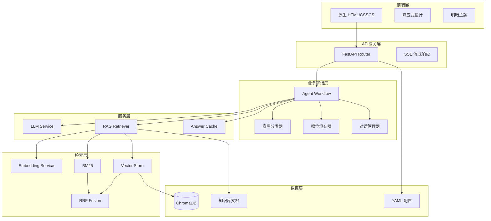
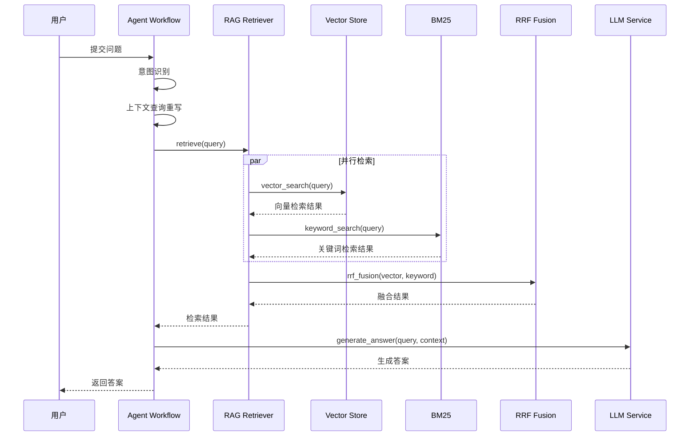

# 校园百事通

> RAG 驱动的校园智能问答系统，基于混合检索策略实现高召回率的校园政策咨询。

---

## 项目概述

### 基本信息

| 属性 | 内容 |
|------|------|
| **项目名称** | 校园百事通 |
| **项目简介** | RAG 驱动的校园智能问答系统，支持多轮对话、意图识别、混合检索 |
| **当前状态** | 已完成 |
| **创建日期** | 2026-03 |
| **最后更新** | 2026-04-11 |
| **负责人** | - |
| **仓库地址** | `D:/my project/xybst/校园百事通项目/campus_helper` |

---

## 技术架构

### 架构概览



### RAG 检索流程



### 技术栈

| 层级 | 技术选型 | 版本 | 选型原因 |
|------|----------|------|----------|
| **后端框架** | FastAPI | 0.100+ | 高性能异步框架，自动生成 API 文档 |
| **编程语言** | Python | 3.12 | 生态丰富，AI 库支持完善 |
| **向量数据库** | ChromaDB | 0.4+ | 轻量级，嵌入式部署，无需外部依赖 |
| **Embedding** | BAAI/bge-large-zh-v1.5 | - | 中文语义向量模型，1024 维，效果优秀 |
| **LLM 提供商** | DeepSeek / 智谱 / OpenAI / Anthropic / Ollama | - | 多提供商支持，灵活切换 |
| **分词工具** | jieba | 0.42+ | 中文分词标准库，BM25 依赖 |
| **配置管理** | YAML + dataclass | - | 分层配置，公共/私有分离 |
| **前端** | 原生 HTML/CSS/JS | - | 轻量级实现，无框架依赖 |
| **缓存** | OrderedDict (LRU) | - | 内存缓存，支持语义匹配 |

### 核心模块

```
campus_helper/
├── backend/                       # 后端代码
│   ├── api/routes.py              # API 路由定义
│   ├── core/                      # 核心模块
│   │   ├── config.py              # 配置兼容层
│   │   └── logger.py              # 日志模块
│   ├── models/                    # 数据模型
│   │   ├── schemas.py             # API 请求/响应模型
│   │   └── cache_models.py        # 缓存数据模型
│   ├── services/                  # 业务服务
│   │   ├── agent_workflow.py      # Agent 工作流引擎
│   │   ├── rag_retriever.py       # RAG 检索服务
│   │   ├── bm25.py                # BM25 关键词检索
│   │   ├── llm_service.py         # LLM 服务封装
│   │   ├── answer_cache.py        # 答案缓存服务
│   │   ├── chunker.py             # 文档分块器
│   │   └── knowledge_base.py      # 知识库管理
│   └── main.py                    # 启动入口
├── config/                        # 配置文件
│   ├── settings.yaml              # 公共配置
│   └── settings.local.yaml        # 私有配置（API 密钥）
├── data/                          # 数据文件
│   ├── raw_docs/                  # 原始文档
│   ├── processed/                 # 处理后文档
│   └── knowledge_base/            # 向量数据库
├── models/embedding/              # Embedding 模型缓存
├── frontend/index.html            # 前端界面
├── tests/                         # 测试代码
└── scripts/                       # 工具脚本
```

---

## 核心功能

### 功能清单

| 功能模块 | 功能描述 | 优先级 | 状态 |
|----------|----------|--------|------|
| 智能问答 | 基于知识库回答校园政策问题 | P0 | 已完成 |
| 混合检索 | 向量检索 + BM25 + RRF 融合 | P0 | 已完成 |
| 意图识别 | 关键词 + LLM 混合策略 | P0 | 已完成 |
| 多轮对话 | 上下文理解与追问处理 | P0 | 已完成 |
| 答案缓存 | LRU 淘汰 + 语义匹配 | P1 | 已完成 |
| 上下文查询重写 | 简短回答转完整查询 | P1 | 已完成 |
| 文档智能分块 | Markdown/FAQ 分块策略 | P1 | 已完成 |
| Embedding 预热 | 启动时预加载模型 | P1 | 已完成 |
| 多 LLM 提供商 | 5 种提供商一键切换 | P1 | 已完成 |
| YAML 分离配置 | 公共/私有配置分离 | P1 | 已完成 |

### 功能实现细节

#### 混合检索策略

**功能描述**：结合向量语义检索与 BM25 关键词检索，通过 RRF 融合算法提升召回率。

**实现方案**：

```python
# rag_retriever.py - RRF 融合算法
def rrf_fusion(
    self,
    vector_results: List[RetrievalResult],
    keyword_results: List[RetrievalResult],
    k: int = 60
) -> List[RetrievalResult]:
    """
    RRF (Reciprocal Rank Fusion) 结果融合
    公式: score(d) = sum(1 / (k + rank(d)))
    """
    doc_scores: Dict[int, float] = {}

    # 处理向量检索结果
    for rank, result in enumerate(vector_results):
        doc_id = hash(result.content)
        score = 1.0 / (k + rank + 1)
        doc_scores[doc_id] = doc_scores.get(doc_id, 0) + score

    # 处理关键词检索结果
    for rank, result in enumerate(keyword_results):
        doc_id = hash(result.content)
        score = 1.0 / (k + rank + 1)
        doc_scores[doc_id] = doc_scores.get(doc_id, 0) + score

    return sorted(doc_scores.items(), key=lambda x: x[1], reverse=True)
```

**关键文件**：
- `backend/services/rag_retriever.py` - RAG 检索器入口
- `backend/services/bm25.py` - BM25 算法实现

**注意事项**：
- RRF 参数 k=60 为经验值，对评分尺度不敏感
- 向量检索使用 cosine 距离，BM25 使用 TF-IDF 加权

#### BM25 关键词检索

**功能描述**：基于 jieba 分词的中文 BM25 实现，补充向量检索的精确匹配能力。

**实现方案**：

```python
# bm25.py - BM25 评分公式
def _score_document(self, query_tokens, doc_tokens, doc_length):
    """
    BM25 评分公式:
    score(D,Q) = sum(IDF(qi) * (tf(qi,D) * (k1+1)) / (tf(qi,D) + k1*(1-b+b*|D|/avgdl)))
    """
    score = 0.0
    for term in query_tokens:
        tf = doc_term_freqs[term]
        idf = self._get_idf(term)
        numerator = tf * (self.k1 + 1)
        denominator = tf + self.k1 * (1 - self.b + self.b * doc_length / self.avg_doc_length)
        score += idf * numerator / denominator
    return score
```

**参数配置**：
- k1 = 1.5（词频饱和参数）
- b = 0.75（文档长度归一化参数）

#### 答案缓存

**功能描述**：LRU 缓存 + 语义相似度匹配，减少重复 LLM 调用。

**实现方案**：

```python
# answer_cache.py - 双模式缓存查询
def get(self, query: str, embedding: List[float], intent: str) -> Optional[CacheEntry]:
    # 1. 精确匹配
    key = self._generate_key(query, intent)
    if key in self._cache:
        return self._cache[key]

    # 2. 语义相似度匹配
    if embedding:
        for cached_key, entry in self._cache.items():
            similarity = self._cosine_similarity(embedding, entry.embedding)
            if similarity >= self._similarity_threshold:  # 0.95
                return entry

    return None
```

**缓存配置**：
- max_size: 1000（最大条目数）
- ttl_seconds: 3600（过期时间）
- similarity_threshold: 0.95（语义匹配阈值）

**关键文件**：
- `backend/services/answer_cache.py` - 缓存服务实现

#### 上下文查询重写

**功能描述**：解决多轮对话中追问场景问题，将简短回答转换为完整查询。

**问题场景**：
```
用户: 奖学金怎么申请？
AI: ...你是本科生还是研究生？
用户: 本科
AI: （错误）关于"本科"这个问题...  # 应回答"本科生奖学金申请"
```

**实现方案**：

```python
# llm_service.py - 查询重写
async def rewrite_query_with_context(self, query: str, history: List[Dict]) -> str:
    """根据对话历史重写查询"""
    if not history or len(query) > 15:
        return query  # 不需要重写

    # LLM 分析上下文并重写
    prompt = f"根据对话历史，将用户简短回答重写为完整问题..."
    rewritten = await self.generate(prompt)
    return rewritten
```

**重写规则**：
- 输入长度 > 15 字符：不重写
- 无对话历史：不重写
- LLM 判断为追问回答：重写为完整查询

#### 意图识别

**功能描述**：混合策略意图分类，关键词快速匹配 + LLM 语义理解。

**意图类型**：
- `knowledge_qa`：知识问答（校园政策、时间地点）
- `personal_query`：个人查询（课表、成绩、学分）
- `affair_guide`：事务办理（开证明、请假、转专业）
- `chitchat`：闲聊（打招呼、感谢）

**实现方案**：

```python
# agent_workflow.py - 混合意图识别
class IntentClassifier:
    HIGH_WEIGHT_KEYWORDS = {
        IntentType.PERSONAL_QUERY: ["我的课表", "我的成绩", "查我"],
        IntentType.AFFAIR_GUIDE: ["怎么办理", "如何申请", "开证明"],
        IntentType.CHITCHAT: ["你好", "谢谢", "再见"]
    }

    @classmethod
    async def classify_with_llm(cls, query: str, llm: LLMService):
        # 1. 关键词快速匹配
        for intent, keywords in cls.HIGH_WEIGHT_KEYWORDS.items():
            if any(kw in query for kw in keywords):
                return intent, 0.9

        # 2. LLM 语义理解
        return await cls._llm_classify(query, llm)
```

---

## 设计决策

### 技术选型

#### 选择 ChromaDB 作为向量数据库

**背景**：校园问答系统需要轻量级部署，无需外部数据库依赖。

**备选方案**：

| 方案 | 优点 | 缺点 |
|------|------|------|
| ChromaDB | 嵌入式部署、零配置、Python 原生 | 不适合大规模生产 |
| Milvus | 高性能、分布式 | 需要外部部署、运维复杂 |
| Pinecone | 全托管、高性能 | 付费服务、数据出境 |
| FAISS | 高性能、Meta 出品 | 仅索引库，需自建存储 |

**最终决策**：选择 ChromaDB

**决策理由**：
1. 嵌入式部署，无需外部依赖
2. 持久化存储，重启不丢数据
3. Python 原生，集成简单

**权衡取舍**：
- 放弃了 Milvus 的高性能分布式能力，但获得了零运维的部署体验

#### 选择混合检索策略

**背景**：单一检索方式召回率不足，向量检索对精确关键词匹配效果差。

**备选方案**：

| 方案 | 优点 | 缺点 |
|------|------|------|
| 纯向量检索 | 语义理解强 | 关键词匹配弱 |
| 纯 BM25 | 关键词精确 | 无语义理解 |
| 向量 + BM25 + RRF | 互补优势 | 计算量增加 |

**最终决策**：向量 + BM25 + RRF 融合

**决策理由**：
1. 向量检索擅长语义相似，BM25 擅长关键词精确匹配
2. RRF 融合无需调参，效果稳定
3. 两种检索可并行执行，延迟可控

### 架构演进

| 日期 | 版本 | 变更内容 | 变更原因 |
|------|------|----------|----------|
| 2026-03 | v1.0 | 初始架构 | 项目启动 |
| 2026-03 | v1.1 | 添加 BM25 检索 | 提升关键词召回 |
| 2026-03 | v1.2 | RRF 融合算法 | 统一向量和关键词结果 |
| 2026-04 | v1.3 | 上下文查询重写 | 解决追问场景问题 |
| 2026-04 | v1.4 | YAML 分离配置 | API 密钥安全管理 |

---

## 测试覆盖

### 测试策略

| 测试类型 | 覆盖范围 | 工具/框架 | 运行频率 |
|----------|----------|-----------|----------|
| **单元测试** | RAG 检索、BM25、缓存、意图识别 | pytest | 每次提交 |
| **集成测试** | Agent 工作流、API 端点 | pytest | 每次合并 |
| **功能测试** | 端到端问答流程 | 手动测试 | 每次发布 |

### 测试覆盖详情

项目包含 116 个测试用例，覆盖以下模块：

| 模块 | 测试数量 | 覆盖场景 |
|------|----------|----------|
| RAG 检索器 | 20 | RRF 融合、向量检索、关键词检索、边界条件 |
| BM25 | 15 | 分词、评分、停用词、文档索引 |
| 答案缓存 | 15 | LRU 淘汰、语义匹配、TTL 过期 |
| 意图识别 | 15 | 关键词匹配、LLM 分类、置信度 |
| 槽位填充 | 10 | 实体提取、槽位更新 |
| Agent 工作流 | 20 | 多轮对话、状态管理、查询重写 |
| 文档分块 | 10 | Markdown 分块、FAQ 分块 |
| 集成测试 | 11 | 端到端流程 |

### 测试命令

```bash
# 运行所有测试
pytest tests/test_all.py -v

# 运行特定模块测试
pytest tests/test_all.py::TestRAGRetriever -v

# 生成覆盖率报告
pytest tests/test_all.py --cov=backend --cov-report=html
```

---

## 部署说明

### 环境要求

| 依赖 | 最低版本 | 推荐版本 | 说明 |
|------|----------|----------|------|
| Python | 3.9 | 3.12 | 运行环境 |
| pip | 21.0 | 24.0 | 包管理器 |

### 环境变量

```bash
# config/settings.local.yaml - 私有配置
llm:
  provider: deepseek  # 可选: zhipu/openai/anthropic/local
  providers:
    deepseek:
      api_key: "your-deepseek-api-key"
    zhipu:
      api_key: "your-zhipu-api-key"
```

### 启动步骤

#### 开发环境

```bash
# 1. 进入项目目录
cd campus_helper

# 2. 创建虚拟环境
python -m venv venv
venv\Scripts\activate  # Windows
# source venv/bin/activate  # Linux/Mac

# 3. 安装依赖
pip install -r requirements.txt

# 4. 配置 API 密钥
cp config/settings.yaml config/settings.local.yaml
# 编辑 settings.local.yaml，填入 API 密钥

# 5. 启动后端
python backend/main.py

# 6. 打开前端
# 浏览器打开 frontend/index.html
```

### 访问地址

| 服务 | 地址 |
|------|------|
| 后端 API | http://localhost:8000 |
| API 文档 | http://localhost:8000/docs |
| 前端界面 | frontend/index.html |

### 部署检查清单

- [x] 环境变量已正确配置
- [x] Embedding 模型已下载（首次运行自动下载）
- [x] 知识库文档已处理
- [x] API 密钥已配置

---

## 项目亮点

### 关键特性

#### 混合检索策略

**价值**：提升召回准确率，兼顾语义理解和关键词精确匹配。

**实现亮点**：
- 向量检索使用 bge-large-zh-v1.5 中文模型
- BM25 基于 jieba 分词，支持停用词过滤
- RRF 融合无需调参，效果稳定

#### 答案缓存

**价值**：减少 LLM 调用成本，提升响应速度。

**实现亮点**：
- LRU 淘汰策略，内存可控
- 语义相似度匹配，相似问题命中缓存
- TTL 过期机制，保证答案新鲜度

#### Embedding 预热

**价值**：消除首次查询延迟，提升用户体验。

**实现亮点**：
- 启动时自动预加载模型
- 执行预热推理，预编译计算图
- 支持本地缓存，避免重复下载

### 性能指标

| 指标 | 目标值 | 实际值 | 说明 |
|------|--------|--------|------|
| 首次查询延迟 | < 3s | ~2s | Embedding 预热后 |
| 缓存命中延迟 | < 100ms | ~50ms | 缓存命中时 |
| 测试覆盖率 | > 80% | ~85% | 核心模块 |
| 测试用例数 | > 100 | 116 | 全覆盖 |

### 创新点

1. **混合检索策略**：向量 + BM25 + RRF 融合，兼顾语义和关键词
2. **上下文查询重写**：解决多轮对话追问场景，提升对话连贯性
3. **YAML 分离配置**：公共配置与私有配置分离，API 密钥安全管理

---

## 附录

### 相关文档

- [README.md](./README.md) - 项目说明
- [ARCHITECTURE.md](./ARCHITECTURE.md) - 系统架构文档
- [USAGE.md](./USAGE.md) - 使用说明
- [CONFIG_GUIDE.md](./CONFIG_GUIDE.md) - 配置指南
- [CHANGELOG.md](./CHANGELOG.md) - 变更日志

### 参考资料

- [ChromaDB 文档](https://docs.trychroma.com/)
- [BGE Embedding 模型](https://huggingface.co/BAAI/bge-large-zh-v1.5)
- [RRF 融合算法论文](https://plg.uwaterloo.ca/~gvcormac/cormacksigir09-rrf.pdf)

---

> 文档最后更新：`2026-05-15` | 维护者：`executor_li`
