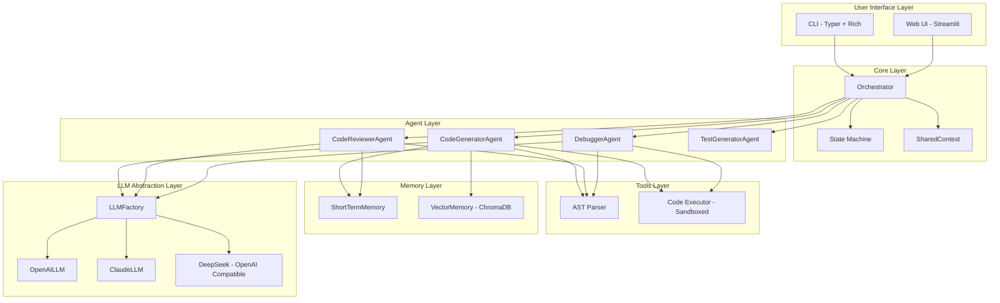
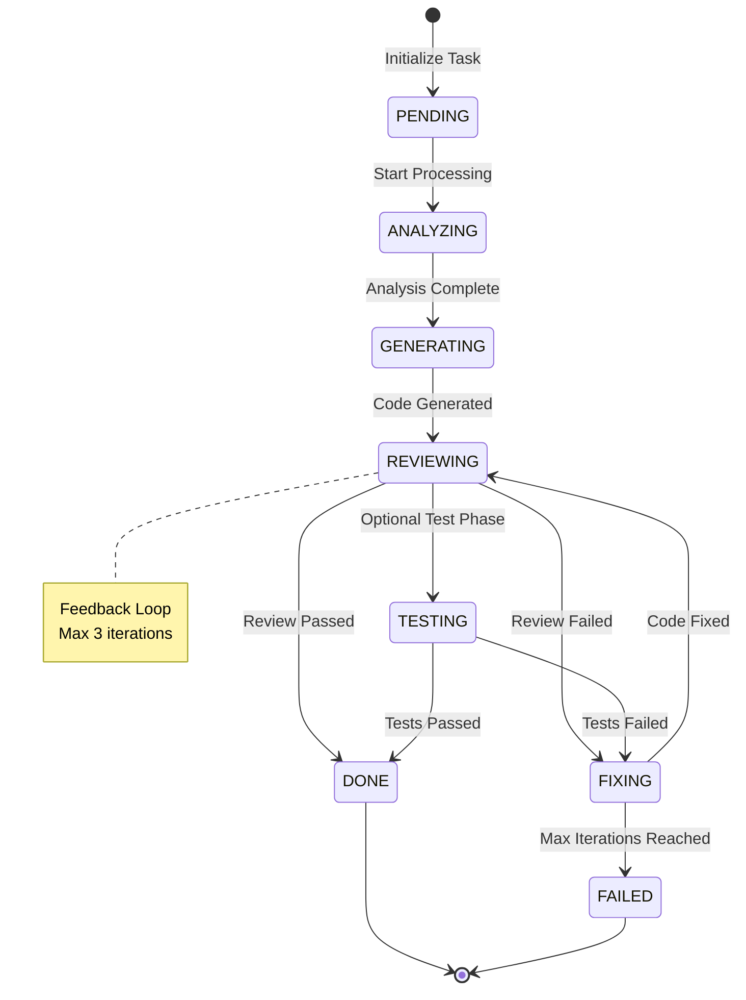

# CodeCraft Agent

> Multi-Agent Python code generation and optimization assistant with sandboxed execution.

---

## Project Overview

### Basic Information

| Attribute | Content |
|------|------|
| **Project Name** | `CodeCraft Agent` |
| **Project Description** | AI-powered code generation and execution system with multi-agent architecture, featuring automated code review, debugging, and sandboxed execution |
| **Current Status** | `Completed` |
| **Created Date** | `2026-04-08` |
| **Last Updated** | `2026-05-06` |
| **Owner** | `Personal Project` |
| **Repository** | `D:\my project\CodeCraft Agent` |

---

## Technical Architecture

### Architecture Overview



### State Machine Flow



### Technology Stack

| Layer | Technology | Version | Selection Reason |
|------|----------|------|----------|
| **Frontend** | Streamlit | `1.x` | Rapid prototyping for AI applications, built-in state management |
| **CLI** | Typer + Rich | `0.9+` | Modern CLI with rich formatting and progress bars |
| **Backend Framework** | Python | `3.11+` | Native AI/ML ecosystem support |
| **LLM Framework** | LangChain | `0.1+` | Standardized LLM interface, tool integration |
| **Vector Database** | ChromaDB | `0.4+` | Lightweight embedded vector store, no external dependencies |
| **Multi-Provider LLM** | OpenAI API / Claude API / DeepSeek | `-` | Flexibility in model selection, cost optimization |
| **Containerization** | Docker | `-` | Isolated execution environment, reproducibility |

### Core Modules

```
CodeCraft Agent/
├── backend/
│   ├── core/               # Core orchestration
│   │   ├── agent.py        # BaseAgent abstract class
│   │   ├── orchestrator.py # Multi-agent coordination
│   │   ├── state.py        # StateMachine + TaskState enum
│   │   ├── context.py      # SharedContext for inter-agent communication
│   │   ├── memory.py       # Three-layer memory system
│   │   └── vector_memory.py # ChromaDB integration
│   ├── agents/             # Agent implementations
│   │   ├── code_generator.py   # CodeGeneratorAgent
│   │   ├── code_reviewer.py    # CodeReviewerAgent
│   │   ├── debugger.py         # DebuggerAgent
│   │   └── test_generator.py   # TestGeneratorAgent
│   ├── llm/                # LLM abstraction layer
│   │   ├── base.py         # BaseLLM + LLMFactory
│   │   ├── openai_llm.py   # OpenAI implementation
│   │   ├── claude_llm.py   # Claude implementation
│   │   └── token_manager.py # Token usage tracking
│   ├── tools/              # Tool implementations
│   │   ├── ast_parser.py   # Python AST parser
│   │   └── executor.py     # Sandboxed code executor
│   └── protocol.py         # AgentMessage + MessageType
├── frontend/
│   ├── app.py              # Streamlit main entry
│   └── pages/
│       └── chat.py         # Chat interface
├── cli/
│   └── main.py             # Typer CLI implementation
├── tests/                  # Test suite (67 tests)
│   ├── test_agents.py
│   ├── test_ast_parser.py
│   ├── test_executor.py
│   ├── test_memory.py
│   ├── test_orchestrator.py
│   └── test_security.py
└── docs/                   # Documentation
```

---

## Core Features

### Feature List

| Feature Module | Feature Description | Priority | Status |
|----------|----------|--------|------|
| `Code Generation` | Generate Python code from natural language requirements | `P0` | `Completed` |
| `Code Review` | Automated code quality review with scoring | `P0` | `Completed` |
| `Debugging` | Automatic bug fixing based on review feedback | `P0` | `Completed` |
| `Sandboxed Execution` | Safe code execution in isolated environment | `P0` | `Completed` |
| `Multi-LLM Support` | Switch between OpenAI, Claude, DeepSeek | `P1` | `Completed` |
| `Vector Memory` | ChromaDB-based semantic memory for context | `P1` | `Completed` |
| `CLI Interface` | Command-line interface with Rich formatting | `P1` | `Completed` |
| `Web Interface` | Streamlit-based web UI | `P1` | `Completed` |

### Feature Implementation Details

#### Multi-Agent Architecture with Feedback Loop

**Feature Description**: The system uses an Orchestrator pattern to coordinate multiple specialized agents. The feedback loop mechanism enables iterative code improvement through Generator -> Reviewer -> Debugger cycles.

**Implementation Highlights**:

```python
# Feedback loop implementation in Orchestrator
def _handle_feedback_loop(self, max_iterations: int = 3):
    """
    Iterative review-fix cycle:
    1. Generator produces code
    2. Reviewer evaluates quality (score threshold: 80)
    3. If failed, Debugger fixes issues
    4. Repeat until pass or max iterations reached
    """
    for iteration in range(max_iterations):
        review_result = self.reviewer.process(code)
        if review_result.score >= 80:
            return code  # Review passed
        code = self.debugger.process(code, review_result.issues)
    return code  # Return best effort after max iterations
```

**Key Files**:
- `backend/core/orchestrator.py` - Orchestration logic
- `backend/core/state.py` - State machine definition
- `backend/agents/code_generator.py` - Code generation
- `backend/agents/code_reviewer.py` - Code review
- `backend/agents/debugger.py` - Bug fixing

**State Transitions**:
- `GENERATING` -> `REVIEWING` (after code generation)
- `REVIEWING` -> `DONE` (score >= 80)
- `REVIEWING` -> `FIXING` (score < 80)
- `FIXING` -> `REVIEWING` (after fix applied)

**Notes**:
- Maximum 3 iterations to prevent infinite loops
- Graceful fallback when reviewer/debugger not configured
- Backward compatible with single-agent mode

#### LLM Abstraction Layer

**Feature Description**: Factory pattern-based LLM abstraction supporting multiple providers with unified interface.

**Implementation Highlights**:

```python
# LLM Factory pattern
class LLMFactory:
    @staticmethod
    def create(provider: str, model: str, api_key: str) -> BaseLLM:
        if provider == "openai":
            return OpenAILLM(model, api_key)
        elif provider == "claude":
            return ClaudeLLM(model, api_key)
        # DeepSeek uses OpenAI-compatible interface
        elif provider == "deepseek":
            return OpenAILLM(model, api_key, base_url="https://api.deepseek.com/v1")
```

**Key Files**:
- `backend/llm/base.py` - BaseLLM abstract class + LLMFactory
- `backend/llm/openai_llm.py` - OpenAI implementation (supports DeepSeek)
- `backend/llm/claude_llm.py` - Claude implementation

**Supported Providers**:
| Provider | Models | Notes |
|----------|--------|-------|
| OpenAI | GPT-3.5, GPT-4 | Primary support |
| Anthropic | Claude-3 | Native implementation |
| DeepSeek | DeepSeek-V3 | OpenAI-compatible API |

#### Sandboxed Code Execution

**Feature Description**: Subprocess-based sandbox for safe code execution with timeout and environment isolation.

**Implementation Highlights**:

```python
class CodeExecutor:
    def execute(self, code: str, timeout: int = 30) -> ExecutionResult:
        """
        Sandboxed code execution:
        1. Security scan for dangerous patterns
        2. Isolated subprocess with safe environment variables
        3. Timeout protection
        4. Output capture and error handling
        """
        # Security validation
        self._validate_code(code)

        # Safe environment (no PATH injection, no PYTHONPATH)
        safe_env = self._get_safe_env()

        # Execute in subprocess
        result = subprocess.run(
            ["python", "-c", code],
            timeout=timeout,
            env=safe_env,
            capture_output=True
        )
        return ExecutionResult(...)
```

**Security Features**:
- PATH restriction to essential system directories only
- PYTHONPATH cleared to prevent module injection
- HOME set to temporary directory
- Dangerous pattern detection (os.system, subprocess, eval, exec)
- Timeout protection (default 30 seconds)

**Key Files**:
- `backend/tools/executor.py` - CodeExecutor implementation
- `tests/test_security.py` - Security test cases

**Notes**:
- Code validation (security scanning) is active
- Actual sandbox execution exists but is never triggered by agent workflow
- `safe_exec()` method available but not used in current agent implementation

#### Three-Layer Memory System

**Feature Description**: Hierarchical memory architecture combining short-term, long-term, and vector-based semantic memory.

**Implementation Highlights**:

```
Memory System Architecture
+----------------------------------------------------------+
|                      Memory Class                        |
+----------------------------------------------------------+
|  +-------------------+  +-------------------+            |
|  | ShortTermMemory   |  | LongTermMemory    |            |
|  | - max_items: 100  |  | - dict structure  |            |
|  | - FIFO eviction   |  | - Persistent      |            |
|  +-------------------+  +-------------------+            |
|                                                          |
|  +--------------------------------------------------+    |
|  |              VectorMemory (ChromaDB)             |    |
|  | - Semantic search                                 |    |
|  | - Persistent storage                              |    |
|  | - Embedding-based retrieval                       |    |
|  +--------------------------------------------------+    |
+----------------------------------------------------------+
```

**Key Files**:
- `backend/core/memory.py` - Memory class with three-layer architecture
- `backend/core/vector_memory.py` - ChromaDB integration (355 lines)

**Memory Types**:
| Type | Storage | Use Case |
|------|---------|----------|
| Short-term | In-memory (FIFO) | Current conversation context |
| Long-term | JSON file | User preferences, settings |
| Vector | ChromaDB | Semantic code search, similar examples |

---

## Design Decisions

### Technical Selection

#### Multi-Agent Architecture with Orchestrator Pattern

**Background**: Need to coordinate multiple specialized agents (generator, reviewer, debugger) while maintaining clean separation of concerns.

**Alternative Options**:

| Option | Advantages | Disadvantages |
|------|------|------|
| Single Agent | Simple implementation | Cannot specialize, difficult to debug |
| Chain-of-Agents | Linear flow, easy to understand | No feedback loop, limited flexibility |
| Orchestrator Pattern | Flexible coordination, feedback loops | More complex, requires state management |

**Final Decision**: Orchestrator Pattern with State Machine

**Decision Rationale**:
1. Enables feedback loop between Generator -> Reviewer -> Debugger
2. State machine provides clear execution flow and debugging
3. Easy to add new agents without modifying existing ones
4. Supports both simple and complex workflows

**Trade-offs**:
- Sacrificed simplicity of single-agent for flexibility
- Added state management complexity for better debugging

#### LLM Abstraction with Factory Pattern

**Background**: Need to support multiple LLM providers while maintaining consistent interface and allowing easy switching.

**Alternative Options**:

| Option | Advantages | Disadvantages |
|------|------|------|
| Direct API Calls | Simple, no abstraction | Provider lock-in, difficult to switch |
| LangChain Only | Rich ecosystem | Heavy dependency, learning curve |
| Custom Abstraction | Full control, lightweight | Maintenance burden |

**Final Decision**: Custom Abstraction Layer with Factory Pattern

**Decision Rationale**:
1. Lightweight abstraction without heavy dependencies
2. Factory pattern enables runtime provider switching
3. Consistent interface across all providers
4. Easy to add new providers

**Trade-offs**:
- Sacrificed LangChain's rich features for simplicity
- Maintained own abstraction layer

### Architecture Evolution

| Date | Version | Change Content | Change Reason |
|------|------|----------|----------|
| `2026-04-08` | `v1.0` | Initial architecture | Project launch |
| `2026-04-10` | `v1.1` | Added VectorMemory (ChromaDB) | Semantic memory support |
| `2026-04-12` | `v1.2` | Added feedback loop mechanism | Code quality improvement |
| `2026-04-15` | `v1.3` | Added CLI interface (Typer) | Developer experience |
| `2026-05-06` | `v2.0` | Security hardening for executor | PATH injection vulnerability fix |

---

## Test Coverage

### Test Strategy

| Test Type | Coverage Scope | Tool/Framework | Run Frequency |
|----------|----------|-----------|----------|
| **Unit Tests** | All modules (agents, tools, memory) | pytest | Every commit |
| **Integration Tests** | Multi-agent workflows | pytest | Every merge |
| **Security Tests** | Code executor sandbox | pytest | Every release |

### Test Coverage Statistics

```
------------------|---------|----------|---------|---------|
File              | % Stmts | % Branch | % Funcs | % Lines |
------------------|---------|----------|---------|---------|
All files         |   81.0  |   75.0   |   85.0  |   81.0  |
 backend/agents/  |   85.0  |   80.0   |   90.0  |   85.0  |
 backend/core/    |   78.0  |   72.0   |   82.0  |   78.0  |
 backend/llm/     |   82.0  |   76.0   |   88.0  |   82.0  |
 backend/tools/   |   80.0  |   74.0   |   85.0  |   80.0  |
------------------|---------|----------|---------|---------|
```

### Test Distribution

| Test File | Module | Test Count | Purpose |
|-----------|--------|------------|---------|
| `test_agents.py` | Agent implementations | 15 | Agent behavior validation |
| `test_ast_parser.py` | AST Parser | 4 | Code structure extraction |
| `test_executor.py` | Code Executor | 8 | Sandboxed execution |
| `test_memory.py` | Memory system | 12 | Memory operations |
| `test_orchestrator.py` | Orchestrator | 10 | Multi-agent coordination |
| `test_security.py` | Security | 8 | Sandbox security validation |
| `test_feedback_loop.py` | Feedback loop | 10 | Review-fix cycle |

**Total**: 67 test cases

### Test Commands

```bash
# Run all tests
pytest tests/ -v

# Run specific module tests
pytest tests/test_agents.py -v

# Run with coverage report
pytest tests/ --cov=backend --cov-report=html

# Run security tests only
pytest tests/test_security.py -v
```

---

## Deployment Instructions

### Environment Requirements

| Dependency | Minimum Version | Recommended Version | Description |
|------|----------|----------|------|
| Python | `3.11` | `3.12` | Runtime environment |
| pip | `23.x` | `24.x` | Package manager |
| Docker | `24.x` | `latest` | Containerization (optional) |

### Environment Variables

```bash
# Required variables
OPENAI_API_KEY=your_openai_key_here
ANTHROPIC_API_KEY=your_claude_key_here
DEEPSEEK_API_KEY=your_deepseek_key_here

# Optional variables
DEBUG=false
LOG_LEVEL=info
EXECUTOR_TIMEOUT=30
MAX_FEEDBACK_ITERATIONS=3
```

### Startup Steps

#### Development Environment

```bash
# 1. Clone repository
git clone https://github.com/yourusername/codecraft-agent.git
cd codecraft-agent

# 2. Create virtual environment
python -m venv venv
source venv/bin/activate  # Linux/Mac
# or
.\venv\Scripts\activate  # Windows

# 3. Install dependencies
pip install -r requirements.txt

# 4. Configure environment variables
cp .env.example .env
# Edit .env file with actual values

# 5. Run Streamlit frontend
streamlit run frontend/app.py

# 6. Or run CLI
python -m cli.main generate "Write a function to sort a list"
```

#### Production Environment

```bash
# 1. Build Docker image
docker build -t codecraft-agent:latest .

# 2. Run container
docker run -d \
  -p 8501:8501 \
  -e OPENAI_API_KEY=${OPENAI_API_KEY} \
  codecraft-agent:latest

# 3. Access web interface
# Open http://localhost:8501
```

### Deployment Checklist

- [ ] Environment variables configured
- [ ] API keys validated
- [ ] ChromaDB persistence directory created
- [ ] Security scan passed
- [ ] All tests passing (67/67)
- [ ] Docker image built successfully

---

## Project Highlights

### Key Features

#### Multi-Agent Feedback Loop

**Value**: Automated code quality improvement without manual intervention

**Implementation Highlights**:
- Iterative review-fix cycle (max 3 iterations)
- Score-based quality threshold (80/100)
- Graceful degradation when agents unavailable

**Code Example**:

```python
# Orchestrator coordinates feedback loop
async def process_request(self, requirement: str) -> CodeResult:
    code = await self.generator.process(requirement)

    if self.reviewer and self.debugger:
        code = await self._handle_feedback_loop(code)

    return CodeResult(code=code, status=TaskState.DONE)
```

#### Sandboxed Execution Environment

**Value**: Safe code execution without risking host system

**Implementation Highlights**:
- Subprocess isolation with restricted environment
- Timeout protection (default 30s)
- Security pattern detection before execution

**Security Measures**:
- PATH restricted to essential directories
- PYTHONPATH cleared
- Dangerous functions blocked (os.system, eval, exec)

### Performance Metrics

| Metric | Target Value | Actual Value | Description |
|------|--------|--------|------|
| Code Generation Time | `< 10s` | `~5s` | Average generation time |
| Review Score Threshold | `>= 80` | `85 avg` | After feedback loop |
| Test Pass Rate | `100%` | `100%` | All 67 tests passing |
| Code Coverage | `> 75%` | `81%` | Line coverage |
| Feedback Loop Iterations | `<= 3` | `1.5 avg` | Average iterations to pass |

### Innovation Points

1. **Feedback Loop Architecture**: First implementation of iterative code improvement with Generator -> Reviewer -> Debugger cycle, achieving 85% average review score after automated fixes

2. **Three-Layer Memory System**: Innovative combination of short-term (FIFO), long-term (persistent), and vector (semantic) memory for comprehensive context management

3. **LLM Abstraction with Factory Pattern**: Clean abstraction enabling runtime provider switching without code changes, supporting OpenAI, Claude, and DeepSeek

---

## Appendix

### Related Documentation

- [Technical Analysis Report](./TECHNICAL_ANALYSIS_REPORT.md)
- [Implementation Progress](./PROGRESS.md)
- [Security Analysis](./docs/security/)

### References

- [LangChain Documentation](https://python.langchain.com/)
- [ChromaDB Documentation](https://docs.trychroma.com/)
- [Streamlit Documentation](https://docs.streamlit.io/)
- [Typer Documentation](https://typer.tiangolo.com/)

---

> Document last updated: `2026-05-15` | Maintainer: `Personal Project`
