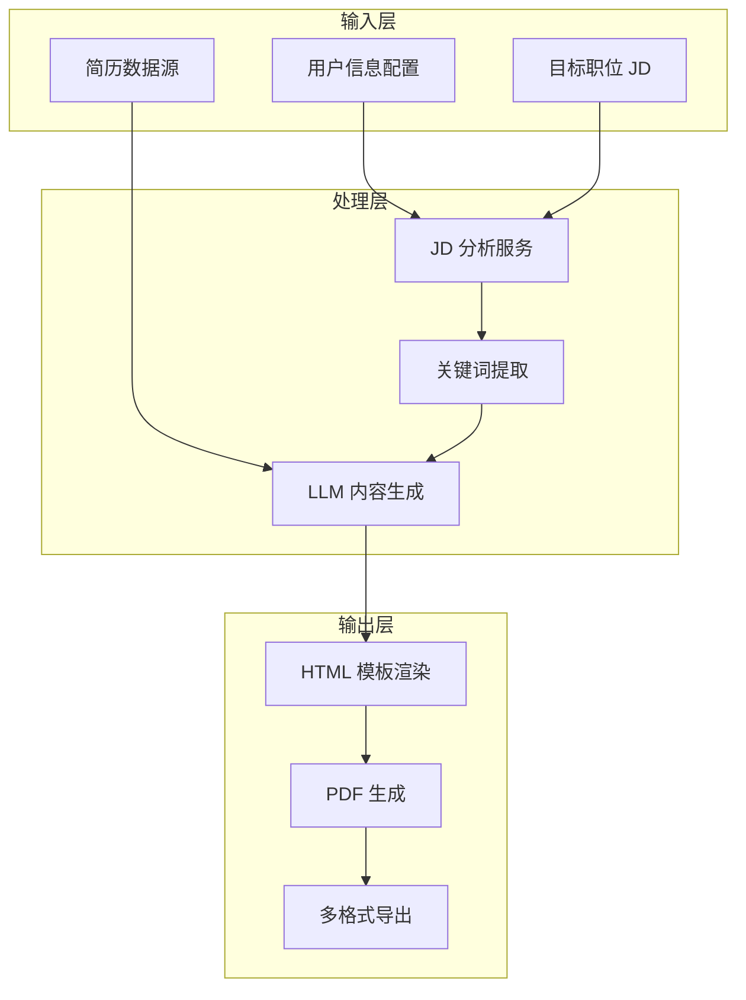
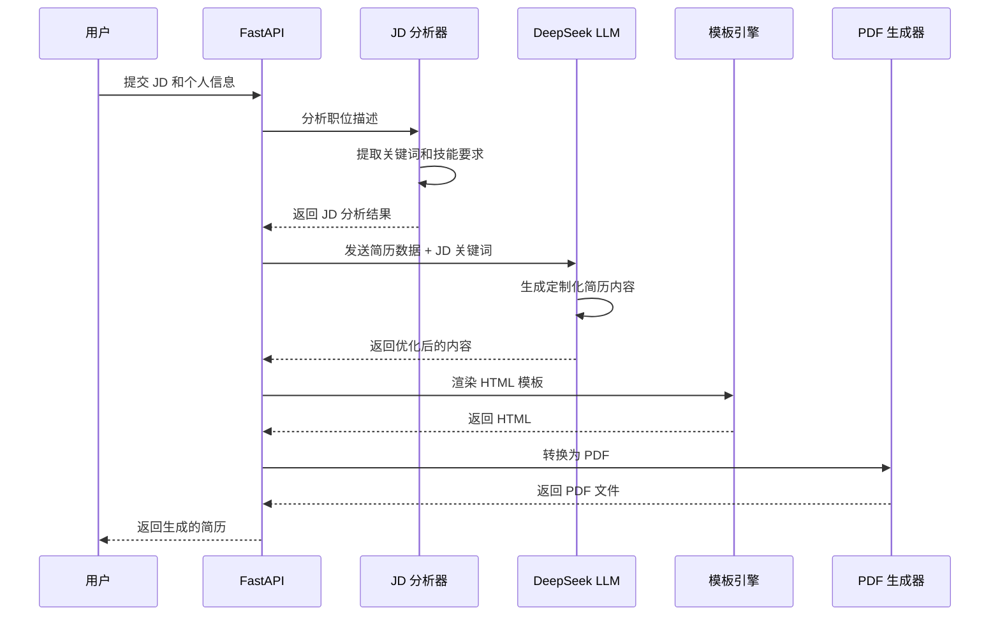

# CV Generator

> AI 驱动的简历定制工具，根据目标职位 JD 自动优化简历内容，提升 ATS 通过率。

---

## 项目概述

### 基本信息

| 属性 | 内容 |
|------|------|
| **项目名称** | `CV Generator` |
| **项目简介** | AI 驱动的简历定制工具，支持 JD 关键词注入和 ATS 优化 |
| **当前状态** | `已完成` |
| **创建日期** | `2026-04-XX` |
| **最后更新** | `2026-05-15` |
| **负责人** | `[负责人姓名]` |
| **仓库地址** | `[GitHub 链接]` |

---

## 技术架构

### 架构概览



### 简历生成流程



### 技术栈

| 层级 | 技术选型 | 版本 | 选型原因 |
|------|----------|------|----------|
| **后端框架** | `FastAPI` | `0.100+` | 高性能异步框架，自动 API 文档生成 |
| **LLM 服务** | `DeepSeek` | `-` | 国产大模型，性价比高，中文能力强 |
| **PDF 生成** | `Node.js + Puppeteer` | `-` | 高保真 HTML 转 PDF，支持自定义字体 |
| **模板引擎** | `HTML + 占位符系统` | `-` | 灵活的模板系统，易于定制 |
| **配置格式** | `YAML` | `-` | 人类可读，便于维护个人信息 |

### 核心模块

```
cv-generator/
├── generate-pdf.mjs          # 核心 PDF 生成脚本 (Node.js)
├── templates/
│   └── cv-template.html      # HTML 模板（双花括号占位符系统）
├── config/
│   └── profile.yml           # 个人信息配置
├── modes/
│   └── pdf.md                # 工作流文档
├── fonts/                    # 自托管字体文件
│   ├── Space Grotesk/        # 标题字体
│   └── DM Sans/              # 正文字体
├── cv.md                     # 简历数据源
└── output/                   # 生成的 PDF 输出目录
```

---

## 核心功能

### 功能清单

| 功能模块 | 功能描述 | 优先级 | 状态 |
|----------|----------|--------|------|
| `JD 分析` | 解析职位描述，提取关键词和技能要求 | `P0` | `已完成` |
| `关键词注入` | 将 JD 关键词智能融入简历内容 | `P0` | `已完成` |
| `ATS 优化` | 优化简历格式以通过 ATS 筛选 | `P0` | `已完成` |
| `PDF 生成` | 高保真 HTML 转 PDF 输出 | `P0` | `已完成` |
| `多模板支持` | 支持多种简历模板样式 | `P1` | `已完成` |
| `中英文支持` | 支持中英文简历生成 | `P1` | `已完成` |

### 功能实现细节

#### JD 分析与关键词提取

**功能描述**：解析职位描述，自动提取技能关键词、经验要求、学历要求等关键信息，为简历优化提供依据。

**实现方案**：

```python
# JD 分析服务核心逻辑
async def analyze_jd(self, jd_text: str) -> JDAnalysisResult:
    """
    分析职位描述，提取关键信息

    Returns:
        JDAnalysisResult: 包含关键词、技能要求、经验要求等
    """
    # 1. 使用 LLM 提取关键词
    keywords = await self._extract_keywords(jd_text)

    # 2. 识别技能要求
    skills = await self._identify_skills(jd_text)

    # 3. 提取经验和学历要求
    requirements = await self._extract_requirements(jd_text)

    return JDAnalysisResult(
        keywords=keywords,
        skills=skills,
        requirements=requirements
    )
```

**关键文件**：
- `backend/app/services/jd_analyzer.py` - JD 分析服务
- `backend/app/models/resume.py` - 数据模型定义

#### JD 关键词注入策略

**功能描述**：将 JD 中的关键词智能融入简历内容，提高简历与职位的匹配度。

**注入策略**：

1. **技能关键词匹配**
   - 扫描 JD 中的技术栈关键词
   - 在简历项目经历中匹配并突出相关技能
   - 优先展示与 JD 最相关的技能组合

2. **职责描述对齐**
   - 分析 JD 中的职责描述
   - 调整简历中项目经历的表述方式
   - 使用 JD 中的关键词描述类似工作内容

3. **量化成果强化**
   - 保留简历中的量化数据
   - 根据 JD 重点调整数据展示顺序

**注意事项**：
- 关键词注入需保持内容真实性，不虚构经历
- 避免过度堆砌关键词导致可读性下降
- 保持简历内容的逻辑连贯性

#### ATS 优化功能

**功能描述**：优化简历格式和内容，确保通过 Applicant Tracking System (ATS) 自动筛选。

**优化要点**：

| 优化项 | 说明 |
|--------|------|
| **格式标准化** | 使用简洁的 HTML 模板，避免复杂排版 |
| **字体兼容性** | 使用 ATS 友好字体（Space Grotesk, DM Sans） |
| **关键词密度** | 确保关键技能词在简历中出现适当次数 |
| **结构清晰** | 标准章节划分：教育、经历、技能、项目 |
| **文件格式** | 输出标准 PDF 格式，确保 ATS 可解析 |

#### PDF 生成流程

**功能描述**：将 HTML 模板渲染为高保真 PDF 文件。

**实现方案**：

```javascript
// generate-pdf.mjs 核心流程
async function generatePDF(data) {
    // 1. 读取 HTML 模板
    const template = await fs.readFile('templates/cv-template.html', 'utf-8');

    // 2. 替换占位符
    const html = template.replace(/\{\{(\w+)\}\}/g, (_, key) => data[key] || '');

    // 3. 使用 Puppeteer 生成 PDF
    const browser = await puppeteer.launch();
    const page = await browser.newPage();
    await page.setContent(html);
    const pdf = await page.pdf({
        format: 'A4',
        printBackground: true
    });
    await browser.close();

    return pdf;
}
```

**关键文件**：
- `generate-pdf.mjs` - PDF 生成脚本
- `templates/cv-template.html` - HTML 模板

---

## 设计决策

### 技术选型

#### 选择 DeepSeek 作为 LLM 服务

**背景**：需要选择一个性价比高、中文能力强的 LLM 服务来生成简历内容。

**备选方案**：

| 方案 | 优点 | 缺点 |
|------|------|------|
| OpenAI GPT-4 | 能力最强，生态完善 | 价格较高，国内访问不稳定 |
| DeepSeek | 国产模型，性价比高，中文能力强 | 相对较新，生态待完善 |
| Claude | 长文本能力强，安全性高 | 价格较高，国内访问受限 |

**最终决策**：选择 `DeepSeek`

**决策理由**：
1. 性价比高，适合高频简历生成场景
2. 中文能力强，适合中文简历生成
3. 国内访问稳定，无需代理

#### 选择 Node.js + Puppeteer 生成 PDF

**背景**：需要将 HTML 模板转换为高保真 PDF。

**备选方案**：

| 方案 | 优点 | 缺点 |
|------|------|------|
| Python WeasyPrint | 纯 Python，易于集成 | 对复杂 CSS 支持有限 |
| Python ReportLab | 功能强大 | 学习曲线陡峭，需手动排版 |
| Node.js Puppeteer | 高保真渲染，支持现代 CSS | 需要额外 Node.js 环境 |

**最终决策**：选择 `Node.js + Puppeteer`

**决策理由**：
1. 渲染效果最接近浏览器显示
2. 支持自定义字体和复杂 CSS
3. 可复用现有前端技术栈

### 模板系统设计

**占位符语法**：使用双花括号 `{{占位符}}` 语法

**支持的占位符**：

| 占位符 | 说明 |
|--------|------|
| `{{name}}` | 姓名 |
| `{{title}}` | 职位标题 |
| `{{email}}` | 邮箱 |
| `{{phone}}` | 电话 |
| `{{education}}` | 教育经历 |
| `{{experience}}` | 工作经历 |
| `{{skills}}` | 技能列表 |
| `{{projects}}` | 项目经历 |

---

## 测试覆盖

### 测试策略

| 测试类型 | 覆盖范围 | 工具/框架 | 运行频率 |
|----------|----------|-----------|----------|
| **单元测试** | JD 分析、关键词提取、内容生成 | `pytest` | 每次提交 |
| **集成测试** | API 端点、PDF 生成流程 | `pytest + httpx` | 每次合并 |
| **E2E 测试** | 完整简历生成流程 | `Playwright` | 每次发布 |

### 测试用例示例

```python
# tests/test_resume_gen.py
class TestResumeGenerator:
    def test_generate_english_resume(self):
        """测试英文简历生成"""
        pass

    def test_generate_chinese_resume(self):
        """测试中文简历生成"""
        pass

    def test_generate_with_target_language(self):
        """测试指定语言生成"""
        pass

    def test_calculate_coverage(self):
        """测试关键词覆盖率计算"""
        pass
```

---

## 部署说明

### 环境要求

| 依赖 | 最低版本 | 推荐版本 | 说明 |
|------|----------|----------|------|
| Python | `3.10` | `3.11+` | 后端运行环境 |
| Node.js | `18.x` | `20.x` | PDF 生成 |
| npm | `9.x` | `10.x` | 包管理器 |

### 环境变量

```bash
# 必需变量
DEEPSEEK_API_KEY=your_api_key_here

# 可选变量
DEBUG=false
LOG_LEVEL=info
```

### 启动步骤

#### 开发环境

```bash
# 1. 克隆仓库
git clone [仓库地址]
cd cv-generator

# 2. 安装 Python 依赖
pip install -r requirements.txt

# 3. 安装 Node.js 依赖
npm install

# 4. 配置个人信息
cp config/profile.yml.example config/profile.yml
# 编辑 profile.yml，填入个人信息

# 5. 启动后端服务
cd backend
uvicorn app.main:app --reload

# 6. 生成 PDF（另开终端）
node generate-pdf.mjs
```

---

## 项目亮点

### 关键特性

#### JD 驱动的智能简历定制

**价值**：大幅提升简历与目标职位的匹配度，增加面试机会。

**实现亮点**：
- 自动提取 JD 关键词和技能要求
- 智能匹配用户经历与 JD 需求
- 保持内容真实性的同时优化表述

#### ATS 友好的格式设计

**价值**：确保简历通过 ATS 自动筛选，不被系统过滤。

**实现亮点**：
- 标准化 HTML 模板结构
- ATS 友好字体选择
- 关键词密度优化算法

#### 高保真 PDF 输出

**价值**：生成专业美观的简历 PDF，提升第一印象。

**实现亮点**：
- Puppeteer 高保真渲染
- 自定义字体支持
- A4 标准格式输出

### 性能指标

| 指标 | 目标值 | 实际值 | 说明 |
|------|--------|--------|------|
| JD 分析时间 | `< 5s` | `~3s` | 含 LLM 调用 |
| 简历生成时间 | `< 10s` | `~8s` | 含 PDF 生成 |
| PDF 文件大小 | `< 500KB` | `~200KB` | 单页简历 |

### 创新点

1. **JD 关键词智能注入**：基于 LLM 的关键词匹配和内容优化，在保持真实性的前提下最大化简历匹配度
2. **模板占位符系统**：灵活的双花括号语法，支持快速定制和扩展
3. **多语言支持**：自动检测 JD 语言，生成对应语言的简历

---

## 附录

### 相关文档

- [API 文档](./api.md)
- [模板开发指南](./template-guide.md)

### 参考资料

- [DeepSeek API 文档](https://platform.deepseek.com/docs)
- [Puppeteer 文档](https://pptr.dev/)
- [ATS 优化最佳实践](https://www.indeed.com/career-advice/resumes-cover-letters/ats-resume)

---

> 文档最后更新：`2026-05-15` | 维护者：`Claude AI`
