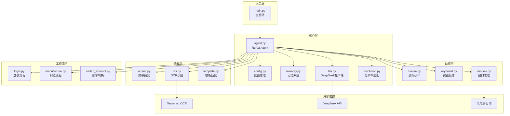

# GameAuto Agent

> 基于 LLM + OCR 的游戏自动化脚本引擎，专为《三角洲行动》设计。

---

## 项目概述

### 基本信息

| 属性 | 内容 |
|------|------|
| **项目名称** | `GameAuto Agent` |
| **项目简介** | 游戏自动化脚本引擎，支持模板匹配界面识别、OCR文字识别、多账号管理和智能休眠策略 |
| **当前状态** | `已归档` |
| **创建日期** | `2026-04-08` |
| **最后更新** | `2026-05-11` |
| **负责人** | - |
| **仓库地址** | 本地项目，未发布到 GitHub |

---

## 技术架构

### 架构概览



### 技术栈

| 层级 | 技术选型 | 版本 | 选型原因 |
|------|----------|------|----------|
| **LLM** | DeepSeek-V3 | - | 性价比高，中文支持好，决策+文本分析 |
| **OCR** | Tesseract / PaddleOCR | v3.1.0 | 开源免费，支持中英文，PaddleOCR中文识别更准确 |
| **自动化** | PyAutoGUI + PyGetWindow | - | 跨平台，API简洁，支持鼠标键盘模拟 |
| **图像处理** | OpenCV | - | 模板匹配性能好，支持多种插值方法 |
| **架构模式** | ReAct | - | 观察-思考-行动循环，适合自动化任务 |
| **配置管理** | YAML | - | 可读性好，支持嵌套配置 |

### 核心模块

```
game-agent/
├── core/                    # 核心模块
│   ├── agent.py            # 主Agent（ReAct模式）
│   ├── config.py           # 配置管理（YAML加载）
│   ├── memory.py           # 记忆系统（账号隔离）
│   ├── llm.py              # DeepSeek LLM客户端
│   ├── resolution.py       # 分辨率适配器
│   ├── logger.py           # 日志系统
│   └── utils.py            # 工具函数
├── perception/              # 感知模块
│   ├── screen.py           # 屏幕捕获（mss）
│   ├── ocr.py              # OCR文字识别+时间解析
│   └── template.py         # 模板匹配（支持缩放）
├── action/                  # 动作模块
│   ├── mouse.py            # 鼠标操作（随机化）
│   ├── keyboard.py         # 键盘操作
│   └── window.py           # 窗口管理
├── workflows/               # 工作流模块
│   ├── login.py            # WeGame登录流程
│   ├── manufacture.py      # 制造队列处理
│   └── switch_account.py   # 账号切换
├── config/                  # 配置文件
│   ├── settings.yaml       # 系统配置
│   ├── settings.local.yaml # 本地配置（API Key）
│   └── accounts.yaml       # 账号配置
├── templates/               # UI模板图片（28个png）
├── logs/                    # 日志和记忆存储
├── tests/                   # 单元测试
├── docs/                    # 文档
├── main.py                  # 入口
└── requirements.txt         # 依赖
```

---

## 核心功能

### 功能清单

| 功能模块 | 功能描述 | 优先级 | 状态 |
|----------|----------|--------|------|
| `模板匹配` | 基于OpenCV的UI元素定位，支持多分辨率缩放 | P0 | 已完成 |
| `OCR识别` | 文字识别和倒计时解析（HH:MM:SS/中文格式） | P0 | 已完成 |
| `多账号管理` | 配置多账号，自动切换，独立记忆 | P0 | 已完成 |
| `智能休眠` | 根据最早到期时间动态计算休眠时长 | P0 | 已完成 |
| `鼠标随机化` | 点击位置随机偏移，模拟人类操作 | P1 | 已完成 |
| `错误恢复` | LLM分析异常并决策处理方案 | P1 | 已完成 |
| `日志记录` | 操作日志和情景记忆持久化 | P1 | 已完成 |
| `多分辨率支持` | 动态坐标转换和模板缩放 | P1 | 已完成 |

### 功能实现细节

#### 模板匹配界面识别

**功能描述**：使用OpenCV模板匹配算法定位游戏UI元素，支持多分辨率自动缩放。

**实现方案**：

```python
# perception/template.py:146-161
def _match_single(self, gray_image: np.ndarray, template_name: str) -> MatchResult:
    """匹配单个模板（支持多分辨率缩放）"""
    template = self._load_template(template_name)
    if template is None:
        return MatchResult(False, None, 0.0, template_name)

    # 根据当前分辨率缩放模板
    scaled_template = self._resolution.get_cached_template(template_name, template)
    h, w = scaled_template.shape

    result = cv2.matchTemplate(gray_image, scaled_template, cv2.TM_CCOEFF_NORMED)
    _, max_val, _, max_loc = cv2.minMaxLoc(result)

    if max_val >= self.confidence_threshold:  # 阈值 0.7
        center = (max_loc[0] + w // 2, max_loc[1] + h // 2)
        return MatchResult(True, center, max_val, template_name)

    return MatchResult(False, None, max_val, template_name)
```

**算法参数**：

| 参数 | 值 | 说明 |
|------|-----|------|
| 匹配方法 | `cv2.TM_CCOEFF_NORMED` | 归一化相关系数，结果范围[0,1] |
| 置信度阈值 | `0.7` | 高于此值判定为匹配成功 |
| 模板数量 | `28` | png文件，基于2560x1440分辨率 |
| 插值方法 | `INTER_AREA`（缩小）/ `INTER_CUBIC`（放大） | 自动选择最佳插值 |

**关键文件**：
- `perception/template.py` - 模板匹配核心逻辑
- `core/resolution.py` - 分辨率适配和模板缩放
- `templates/*.png` - UI模板图片（28个）

**注意事项**：
- 模板图片基于2560x1440分辨率制作
- 运行时自动根据窗口分辨率缩放模板
- 使用缓存避免重复计算

#### 智能休眠策略

**功能描述**：遍历所有账号的任务存档，计算最早到期时间，动态决定休眠时长。

**实现方案**：

```python
# core/agent.py:528-561
def _calculate_sleep_time(self) -> int:
    """计算休眠时间"""
    now = int(time.time())
    earliest_finish_time = None

    # 遍历所有账号的任务存档
    logs_path = Path(__file__).parent.parent / "logs"
    for account in self.config.accounts:
        task_file = logs_path / f"{account.name}_tasks.json"
        if task_file.exists():
            with open(task_file, 'r', encoding='utf-8') as f:
                tasks = json.load(f)
            for task in tasks:
                ft = int(task.get("finish_time", 0))
                if ft > now:
                    if earliest_finish_time is None or ft < earliest_finish_time:
                        earliest_finish_time = ft

    # 计算休眠时间
    if earliest_finish_time is None:
        sleep_time = self.config.timing.loop_interval  # 默认1800秒
    else:
        sleep_time = max(0, earliest_finish_time - now)
        if sleep_time > self.config.timing.max_sleep:  # 最大1800秒
            sleep_time = self.config.timing.max_sleep

    return sleep_time
```

**策略逻辑**：

```
1. 读取所有账号的任务存档（logs/{account}_tasks.json）
2. 找出最早的到期时间
3. 计算休眠时长 = 最早到期时间 - 当前时间
4. 限制最大休眠时长（默认1800秒）
5. 无任务时使用默认间隔
```

**关键文件**：
- `core/agent.py` - 休眠计算逻辑
- `workflows/manufacture.py` - 任务存档读写
- `logs/{account}_tasks.json` - 任务存档文件

#### 错误恢复机制

**功能描述**：遇到异常时截图保存，OCR识别文字，LLM分析并决策处理方案。

**实现方案**：

```python
# core/agent.py:408-441
def _handle_error(self, error: str) -> bool:
    """处理错误"""
    # 截图保存
    screenshot = self.tools["screen"].capture()
    screenshot_path = f"logs/error_{int(time.time())}.png"
    self.tools["screen"].save(screenshot, screenshot_path)

    # OCR识别文字
    ocr_result = self.tools["ocr"].extract(screenshot)
    ocr_text = ocr_result.text if ocr_result.text else "无法识别文字"

    # LLM分析OCR文字
    llm_response = self.llm.chat(f"""
遇到错误：{error}

屏幕文字内容：
{ocr_text}

请分析当前状态并决定如何处理。
1. 当前是什么异常？
2. 应该如何处理？
3. 是否需要重试？

以JSON格式返回：{{"analysis": "分析", "action": "处理方案", "should_retry": true/false}}
""")

    # 解析LLM响应
    result = self._parse_llm_json(llm_response)
    if result.get("should_retry"):
        return self.run_cycle("重试任务")

    return False
```

**恢复流程**：

```
1. 捕获异常
2. 截图保存到 logs/error_{timestamp}.png
3. OCR识别屏幕文字
4. LLM分析异常并决策
5. 根据决策执行重试或跳过
6. 记录情景记忆
```

**关键文件**：
- `core/agent.py` - 错误处理逻辑
- `core/memory.py` - 情景记忆记录

#### 鼠标随机化

**功能描述**：点击位置添加随机偏移，移动时间随机化，模拟人类操作。

**实现方案**：

```python
# action/mouse.py:38-57
def click(self, x: int = None, y: int = None, button: str = "left", clicks: int = 1,
          duration: float = None, random_offset: int = 3):
    """点击指定位置"""
    if x is not None and y is not None:
        self.move(x, y, duration, random_offset)

    # 随机延迟
    time.sleep(random.uniform(0.05, 0.15))
    pyautogui.click(button=button, clicks=clicks)

def move(self, x: int, y: int, duration: float = None, random_offset: int = 3):
    """移动鼠标到指定位置"""
    # 添加随机偏移
    x += random.randint(-random_offset, random_offset)
    y += random.randint(-random_offset, random_offset)

    if duration is None:
        duration = random.uniform(0.2, 0.4)

    pyautogui.moveTo(x, y, duration=duration)
```

**随机化参数**：

| 参数 | 范围 | 说明 |
|------|------|------|
| 位置偏移 | ±3像素 | 点击位置随机偏移 |
| 移动时间 | 0.2~0.4秒 | 鼠标移动耗时随机 |
| 点击延迟 | 0.05~0.15秒 | 点击前后随机等待 |

---

## 设计决策

### 技术选型

#### 混合架构：工作流 + Agent

**背景**：需要平衡稳定性和灵活性，纯脚本缺乏异常处理能力，纯Agent决策不可预测。

**备选方案**：

| 方案 | 优点 | 缺点 |
|------|------|------|
| 纯脚本 | 稳定、可预测、无API成本 | 无异常处理能力，遇到问题直接失败 |
| 纯Agent | 灵活、自适应 | 决策不可预测，API成本高，延迟大 |
| 混合架构 | 稳定流程+灵活异常处理 | 架构复杂度高 |

**最终决策**：选择 `混合架构`

**决策理由**：
1. 日常操作（登录、制造）由工作流脚本执行，保证稳定性
2. 异常情况（弹窗、错误）由Agent+LLM处理，提供自适应能力
3. 降低API调用频率，减少成本和延迟

**权衡取舍**：
- 放弃了纯Agent的完全自适应能力，但获得了稳定可预测的日常运行

### 架构演进

| 日期 | 版本 | 变更内容 | 变更原因 |
|------|------|----------|----------|
| `2026-04-08` | `v1.0` | 初始架构，ReAct模式 | 项目启动 |
| `2026-04-10` | `v1.1` | VL视觉模型改为OCR+LLM | 降低成本，提高响应速度 |
| `2026-04-15` | `v1.2` | 清理未使用代码 | 代码质量优化 |
| `2026-04-19` | `v1.3` | 安全修复、异常处理改进 | 朝廷工作流整改 |
| `2026-05-11` | `v1.4` | 多分辨率支持 | 适配不同显示器 |

---

## 测试覆盖

### 测试策略

| 测试类型 | 覆盖范围 | 工具/框架 | 运行频率 |
|----------|----------|-----------|----------|
| **单元测试** | 分辨率适配、配置加载、OCR、记忆系统 | pytest | 每次修改 |
| **集成测试** | 工作流执行、Agent循环 | 手动测试 | 每次发布 |
| **E2E测试** | 完整游戏流程 | 手动测试 | 重大变更 |

### 测试文件

```
tests/
├── test_config.py       # 配置加载测试
├── test_ocr.py          # OCR识别测试
├── test_memory.py       # 记忆系统测试
├── test_utils.py        # 工具函数测试
└── test_resolution.py   # 分辨率适配测试
```

### 测试命令

```bash
# 运行所有测试
pytest tests/

# 运行单个测试文件
pytest tests/test_resolution.py -v

# 生成覆盖率报告
pytest tests/ --cov=. --cov-report=html
```

---

## 部署说明

### 环境要求

| 依赖 | 最低版本 | 推荐版本 | 说明 |
|------|----------|----------|------|
| Python | `3.8` | `3.10+` | 运行环境 |
| Tesseract OCR | `4.0` | `5.0+` | OCR引擎 |
| OpenCV | `4.5` | `4.8+` | 图像处理 |

### 环境变量

```bash
# 必需变量（使用LLM功能时）
DEEPSEEK_API_KEY=your_api_key_here

# 可选变量
DEBUG=false
LOG_LEVEL=info
```

### 启动步骤

#### 开发环境

```bash
# 1. 进入项目目录
cd "D:\my project\脚本\game-agent"

# 2. 安装依赖
pip install -r requirements.txt

# 3. 配置账号
cp config/accounts.yaml.example config/accounts.yaml
# 编辑 accounts.yaml，填入账号信息

# 4. 配置 API Key（可选）
cp config/settings.local.yaml.example config/settings.local.yaml
# 编辑 settings.local.yaml，填入 DeepSeek API Key

# 5. 启动
python main.py
```

#### 注意事项

- 需要安装 Tesseract OCR 并配置路径
- 模板图片基于 2560x1440 分辨率，其他分辨率自动缩放
- 无 API Key 时仅使用工作流模式（模板匹配+OCR）
- 按 Ctrl+C 可安全停止

### 部署检查清单

- [ ] Python 依赖已安装
- [ ] Tesseract OCR 已安装并配置路径
- [ ] 账号配置文件已创建
- [ ] API Key 已配置（可选）
- [ ] 游戏已安装并可正常启动

---

## 项目亮点

### 关键特性

#### 多分辨率自适应

**价值**：无需为不同分辨率准备不同模板，一套模板适配所有分辨率。

**实现亮点**：
- 基准分辨率 2560x1440，自动计算缩放比例
- 相对比例坐标格式，配置文件无需修改
- 模板自动缩放，选择最佳插值方法
- 缓存机制避免重复计算

**代码示例**：

```python
# 相对比例坐标（推荐）
queue_time_regions:
  技术中心: [0.145, 0.496, 0.039, 0.019]  # x_ratio, y_ratio, w_ratio, h_ratio

# 自动转换为当前分辨率下的绝对坐标
region = resolution.convert_region([0.145, 0.496, 0.039, 0.019])
# 1920x1080: (278, 536, 74, 20)
# 2560x1440: (371, 714, 100, 27)
```

#### 分层感知策略

**价值**：减少LLM调用，降低成本和延迟，同时保持异常处理能力。

**实现亮点**：
- OCR优先识别已知界面关键词
- 模板匹配定位UI元素
- LLM仅作为兜底方案处理未知界面

### 性能指标

| 指标 | 目标值 | 实际值 | 说明 |
|------|--------|--------|------|
| 模板匹配延迟 | `< 100ms` | ~50ms | 单次匹配 |
| OCR识别延迟 | `< 500ms` | ~300ms | Tesseract |
| LLM响应延迟 | `< 3s` | ~2s | DeepSeek-V3 |
| 单账号处理时间 | `< 2min` | ~1.5min | 完整制造流程 |

### 创新点

1. **混合架构**：工作流脚本保证稳定性，Agent+LLM提供异常处理能力，平衡了可靠性和灵活性
2. **分层感知**：OCR优先、模板匹配、LLM兜底的三层感知策略，显著降低API调用频率
3. **智能休眠**：根据任务到期时间动态计算休眠时长，避免无效轮询

---

## 附录

### 相关文档

- [设计文档](./design.md)
- [项目进度](./PROGRESS.md)

### 参考资料

- [OpenCV Template Matching](https://docs.opencv.org/4.x/d4/dc6/tutorial_py_template_matching.html)
- [Tesseract OCR](https://github.com/tesseract-ocr/tesseract)
- [DeepSeek API](https://platform.deepseek.com/docs)
- [PyAutoGUI](https://pyautogui.readthedocs.io/)

---

> 文档最后更新：`2026-05-15` | 维护者：`-`
