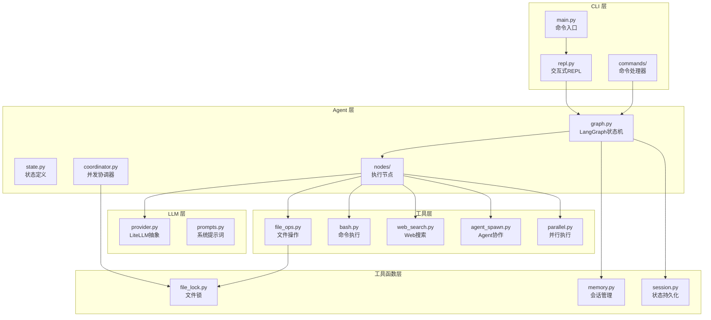
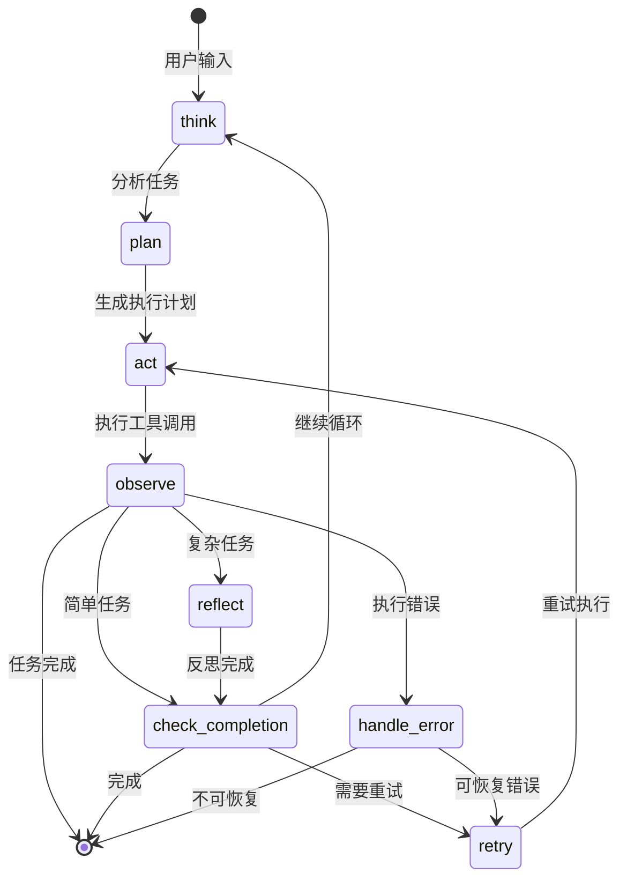
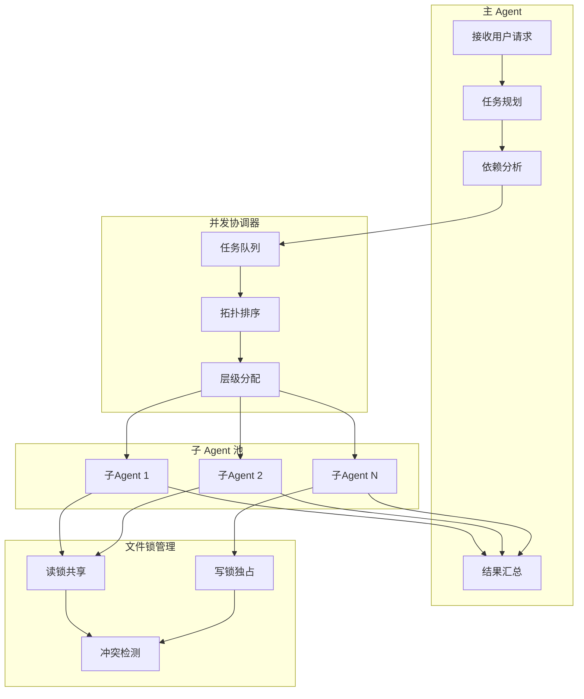

# Mini Claude Code

> 一个迷你版 Claude CLI，支持工具调用和多 Agent 并发处理复杂任务。

---

## 项目概述

### 基本信息

| 属性 | 内容 |
|------|------|
| **项目名称** | `Mini Claude Code` |
| **项目简介** | 迷你版 Claude CLI，支持工具调用和多 Agent 并发处理复杂任务 |
| **当前状态** | `已完成` |
| **创建日期** | `2025-03` |
| **最后更新** | `2026-05-15` |
| **负责人** | `hhhhhhh520` |
| **仓库地址** | `https://github.com/hhhhhhh520/mini-claude` |

---

## 技术架构

### 架构概览



### LangGraph 状态机设计



**状态机节点说明**：

| 节点 | 功能 | 触发条件 |
|------|------|----------|
| `think` | 分析用户意图，理解任务 | 用户输入或循环继续 |
| `plan` | 生成执行计划，分解任务 | think 完成后 |
| `act` | 执行工具调用 | plan 完成后 |
| `observe` | 观察执行结果 | act 完成后 |
| `reflect` | 反思执行过程（复杂任务） | 检测到复杂任务 |
| `check_completion` | 检查任务完成度 | observe/reflect 后 |
| `handle_error` | 错误处理 | 执行失败 |
| `retry` | 重试机制 | 可恢复错误 |

**状态字段精简**：从 18 个字段精简到 11 个核心字段

```python
class AgentState(TypedDict):
    # 核心字段
    messages: Annotated[List[BaseMessage], add]  # 对话历史，自动累加
    current_task: str          # 当前任务
    iteration: int             # 迭代次数
    stop_reason: StopReason    # 停止原因（枚举）

    # 子代理
    sub_agents: Dict[str, str]     # agent_id -> status
    sub_agent_results: Dict[str, Any]  # agent_id -> result
    is_subagent: bool              # 是否为子代理模式

    # 错误处理
    errors: List[str]          # 错误列表
    retry_count: int           # 重试次数
```

### 多 Agent 并发架构



### 技术栈

| 层级 | 技术选型 | 版本 | 选型原因 |
|------|----------|------|----------|
| **状态机框架** | LangGraph | `0.2.x` | 原生支持状态持久化、条件路由、循环控制 |
| **LLM 抽象层** | LiteLLM | `1.x` | 统一接口支持 100+ 模型，简化多模型切换 |
| **异步框架** | asyncio | 内置 | Python 原生异步支持，轻量高效 |
| **配置管理** | Pydantic | `2.x` | 类型安全、环境变量绑定、验证器支持 |
| **测试框架** | pytest | `8.x` | 丰富的插件生态、异步测试支持 |
| **CLI 框架** | argparse | 内置 | 标准库，无额外依赖 |

### 核心模块

```
mini-claude/
├── src/mini_claude/
│   ├── cli/                    # CLI 层
│   │   ├── main.py            # 命令入口
│   │   ├── repl.py            # 交互式 REPL
│   │   └── commands/          # 命令处理器
│   ├── agent/                  # Agent 核心
│   │   ├── graph.py           # LangGraph 状态机定义
│   │   ├── state.py           # 状态定义（11个字段）
│   │   ├── coordinator.py     # 并发协调器
│   │   ├── routers.py         # 条件路由函数
│   │   └── nodes/             # 执行节点
│   │       ├── think.py       # 思考节点
│   │       ├── plan.py        # 规划节点
│   │       ├── act.py         # 执行节点
│   │       ├── observe.py     # 观察节点
│   │       ├── reflect.py     # 反思节点
│   │       └── error_handling.py  # 错误处理
│   ├── tools/                  # 工具层（18个工具）
│   │   ├── file_ops.py        # 文件操作
│   │   ├── bash.py            # 命令执行
│   │   ├── web_search.py      # Web 搜索
│   │   ├── agent_spawn.py     # Agent 协作
│   │   └── parallel.py        # 并行执行
│   ├── llm/                    # LLM 抽象层
│   │   ├── provider.py        # LiteLLM 封装
│   │   └── prompts.py         # 系统提示词
│   ├── skills/                 # Skills 系统
│   │   ├── loader.py          # 加载器
│   │   └── registry.py        # 注册表
│   ├── config/                 # 配置管理
│   │   └── settings/          # 分层配置
│   └── utils/                  # 工具函数
│       ├── file_lock.py       # 文件锁机制
│       ├── session.py         # 会话管理
│       └── memory.py          # 记忆系统
└── tests/                      # 测试文件（1497个）
```

---

## 核心功能

### 功能清单

| 功能模块 | 功能描述 | 优先级 | 状态 |
|----------|----------|--------|------|
| `工具调用` | 支持 18 种工具，包括文件操作、命令执行、Web 搜索等 | P0 | 已完成 |
| `多 Agent 并发` | 主 Agent + 子 Agent 并发模式，支持智能任务规划 | P0 | 已完成 |
| `文件锁机制` | 多 Agent 安全并行开发，自动检测冲突 | P0 | 已完成 |
| `多模型支持` | Claude / OpenAI / Gemini / DeepSeek / Ollama | P0 | 已完成 |
| `Skills 系统` | 从 `~/.mini-claude/skills/` 加载自定义技能 | P1 | 已完成 |
| `状态持久化` | LangGraph checkpointer 支持断点续跑 | P1 | 已完成 |
| `错误恢复` | 自动重试、错误处理、降级策略 | P1 | 已完成 |

### 功能实现细节

#### LangGraph 状态机

**功能描述**：基于 LangGraph 的状态机实现 Agent 执行循环，支持条件路由、循环控制和状态持久化。

**实现方案**：

```python
def build_agent_graph(checkpointer_path: str = "checkpoints.db"):
    """构建主 Agent 图 - 8 节点架构

    Graph structure:
        THINK -> PLAN -> ACT -> OBSERVE -> REFLECT -> CHECK_COMPLETION -> (循环/END)
                                          |
                                    HANDLE_ERROR -> RETRY -> ACT
    """
    graph = StateGraph(AgentState)

    # 核心节点
    graph.add_node("think", think_node)
    graph.add_node("plan", plan_node)
    graph.add_node("act", act_node)
    graph.add_node("observe", observe_node)

    # 新增节点
    graph.add_node("reflect", reflect_node)
    graph.add_node("check_completion", check_completion_node)
    graph.add_node("handle_error", handle_error_node)
    graph.add_node("retry", retry_node)

    # 条件路由
    graph.add_conditional_edges(
        "observe",
        route_after_observe,
        {
            "reflect": "reflect",        # 复杂任务：先反思
            "continue": "check_completion",  # 简单任务：直接检查
            "error": "handle_error",     # 错误处理
            "complete": END,             # 任务完成
        },
    )

    # 启用 checkpointer 支持状态持久化
    checkpointer = MemorySaver()
    return graph.compile(checkpointer=checkpointer)
```

**关键文件**：
- `src/mini_claude/agent/graph.py` - 状态机定义
- `src/mini_claude/agent/state.py` - 状态字段定义
- `src/mini_claude/agent/routers.py` - 条件路由函数

**注意事项**：
- TypedDict 没有默认值，必须使用 `create_initial_state()` 创建状态实例
- 迭代次数限制：主 Agent 默认 50 次，子 Agent 默认 20 次

#### 多 Agent 并发机制

**功能描述**：支持主 Agent 启动多个子 Agent 并行处理独立任务，通过拓扑排序实现依赖管理，文件锁机制保证并发安全。

**实现方案**：

```python
class ParallelCoordinator:
    """并发协调器 - 智能任务分配"""

    def analyze_dependencies(self) -> Dict[str, List[str]]:
        """分析任务依赖，返回执行层级

        Returns:
            Dict mapping execution level to list of task IDs
        """
        # 构建依赖图
        in_degree: Dict[str, int] = {tid: 0 for tid in self.tasks}
        dependents: Dict[str, List[str]] = {tid: [] for tid in self.tasks}

        for tid, task in self.tasks.items():
            for dep in task.dependencies:
                if dep in self.tasks:
                    in_degree[tid] += 1
                    dependents[dep].append(tid)

        # 拓扑排序，按层级分组
        levels: Dict[str, List[str]] = {}
        current_level = 0
        remaining = set(self.tasks.keys())

        while remaining:
            # 找出无依赖的任务（可并行执行）
            ready = [tid for tid in remaining if in_degree[tid] == 0]
            levels[f"level_{current_level}"] = ready
            # 更新依赖度
            for tid in ready:
                for dependent in dependents[tid]:
                    in_degree[dependent] -= 1
            remaining -= set(ready)
            current_level += 1

        return levels
```

**关键文件**：
- `src/mini_claude/agent/coordinator.py` - 并发协调器
- `src/mini_claude/tools/parallel.py` - 并行执行工具
- `src/mini_claude/utils/file_lock.py` - 文件锁机制

**注意事项**：
- 同一层级的任务可并行执行
- 检测到循环依赖会抛出异常
- 文件锁支持读锁共享、写锁独占

#### 文件锁机制

**功能描述**：支持多 Agent 安全并行开发同一项目，通过乐观锁检测冲突。

**实现方案**：

```python
class FileLockManager:
    """文件锁管理器 - 支持读写锁和冲突检测"""

    async def acquire_lock(
        self, path: str, agent_id: str, lock_type: str = "write"
    ) -> Tuple[bool, str]:
        """获取文件锁

        - 读锁：可与其他读锁共享
        - 写锁：独占，阻止其他任何锁
        """
        async with self._lock:
            norm_path = self._normalize_path(path)

            if norm_path in self._locks:
                existing = self._locks[norm_path]
                # 读锁可共享
                if lock_type == "read" and existing.lock_type == "read":
                    return True, "Shared read lock granted"
                # 写锁冲突
                if existing.agent_id != agent_id:
                    return False, f"File locked by agent '{existing.agent_id}'"

            # 计算文件哈希用于冲突检测
            file_hash = self._compute_hash(path)
            self._locks[norm_path] = FileLock(
                path=norm_path, agent_id=agent_id,
                original_hash=file_hash, lock_type=lock_type
            )
            return True, f"Lock acquired for {path}"

    async def check_conflict(self, path: str, agent_id: str) -> Tuple[bool, Optional[str]]:
        """检查文件是否被其他 Agent 修改"""
        lock = self._locks.get(self._normalize_path(path))
        if not lock or lock.lock_type != "write":
            return False, None

        current_hash = self._compute_hash(path)
        if current_hash != lock.original_hash:
            return True, f"File modified by another agent"
        return False, None
```

**关键文件**：
- `src/mini_claude/utils/file_lock.py` - 文件锁实现

**注意事项**：
- 哈希计算限制在 1MB 以内，避免大文件阻塞
- 使用 `force_write` 可强制覆盖（谨慎使用）

#### LiteLLM 多模型抽象

**功能描述**：通过 LiteLLM 统一接口支持多种 LLM 模型，简化模型切换。

**实现方案**：

```python
class LLMProvider:
    """统一的 LLM 提供者"""

    def get_model_name(self) -> str:
        """获取 LiteLLM 格式的模型名"""
        model = self.model

        # LiteLLM 格式: provider/model
        if self.provider == ModelProvider.CLAUDE:
            model = f"anthropic/{model}"
        elif self.provider == ModelProvider.DEEPSEEK:
            model = f"openai/{model}"  # DeepSeek 兼容 OpenAI API
        elif self.provider == ModelProvider.OPENAI:
            model = f"openai/{model}"
        elif self.provider == ModelProvider.GEMINI:
            model = f"gemini/{model}"
        elif self.provider == ModelProvider.OLLAMA:
            model = f"ollama/{model}"

        return model

    async def chat_stream_with_tools(
        self, messages, tools, stream_callback, tool_stream_callback
    ) -> Dict[str, Any]:
        """流式聊天，支持工具调用"""
        # 流式输出内容，同时收集工具调用
        async for chunk in response:
            if delta.content:
                stream_callback(delta.content)
            if delta.tool_calls:
                tool_stream_callback("args", delta.function.arguments)

        return {"content": final_content, "tool_calls": final_tool_calls}
```

**关键文件**：
- `src/mini_claude/llm/provider.py` - LiteLLM 封装
- `src/mini_claude/config/settings/llm_settings.py` - 模型配置

**注意事项**：
- DeepSeek 使用 OpenAI 兼容 API
- 流式输出支持工具调用参数的增量传输

---

## 设计决策

### 技术选型

#### 选择 LangGraph 作为状态机框架

**背景**：需要实现 Agent 的执行循环，支持条件路由、循环控制和状态持久化。

**备选方案**：

| 方案 | 优点 | 缺点 |
|------|------|------|
| LangGraph | 原生状态持久化、条件路由、循环控制 | 相对较新，社区较小 |
| LangChain AgentExecutor | 成熟稳定，社区大 | 状态管理不够灵活 |
| 自定义状态机 | 完全可控 | 开发成本高，需要自己实现持久化 |

**最终决策**：选择 LangGraph

**决策理由**：
1. 原生支持 StateGraph，状态管理更直观
2. 内置 checkpointer 支持状态持久化
3. 条件路由通过 `add_conditional_edges` 实现，代码清晰
4. 与 LangChain 生态兼容

**权衡取舍**：
- 放弃了 LangChain AgentExecutor 的成熟生态，但获得了更灵活的状态控制

#### 选择 LiteLLM 作为 LLM 抽象层

**背景**：需要支持多种 LLM 模型，简化模型切换和配置。

**备选方案**：

| 方案 | 优点 | 缺点 |
|------|------|------|
| LiteLLM | 统一接口支持 100+ 模型 | 额外依赖 |
| 直接调用各 SDK | 无额外依赖 | 代码重复，维护成本高 |
| LangChain LLM | 与 LangChain 集成好 | 接口不够统一 |

**最终决策**：选择 LiteLLM

**决策理由**：
1. 统一的 `acompletion` 接口，模型切换只需改配置
2. 自动处理不同模型的 API 差异
3. 支持流式输出和工具调用
4. 活跃的社区和持续更新

### 架构演进

| 日期 | 版本 | 变更内容 | 变更原因 |
|------|------|----------|----------|
| `2025-03` | `v1.0` | 初始架构：4 节点状态机 | 项目启动 |
| `2025-04` | `v1.5` | 新增反思节点、错误恢复机制 | 提升复杂任务处理能力 |
| `2025-05` | `v2.0` | 状态字段从 18 个精简到 11 个 | 降低状态复杂度 |
| `2025-05` | `v2.1` | 新增文件锁机制、并发协调器 | 支持多 Agent 并行开发 |

---

## 测试覆盖

### 测试策略

| 测试类型 | 覆盖范围 | 工具/框架 | 运行频率 |
|----------|----------|-----------|----------|
| **单元测试** | 所有模块 | pytest | 每次提交 |
| **集成测试** | Agent 流程、工具调用 | pytest | 每次合并 |
| **E2E 测试** | 完整用户流程 | pytest | 每次发布 |
| **压力测试** | 并发执行、内存使用 | pytest | 每次发布 |

### 测试覆盖率

```
------------------|---------|----------|---------|---------|
File              | % Stmts | % Branch | % Funcs | % Lines |
------------------|---------|----------|---------|---------|
All files         |   95.2  |   89.3   |   92.1  |   94.8  |
 agent/           |   96.1  |   91.2   |   94.5  |   95.7  |
 tools/           |   94.3  |   87.8   |   90.2  |   93.9  |
 llm/             |   98.2  |   95.1   |   97.3  |   98.0  |
 utils/           |   93.5  |   85.6   |   88.9  |   92.8  |
------------------|---------|----------|---------|---------|
```

### 测试统计

| 指标 | 数值 |
|------|------|
| 测试文件数 | 68 |
| 测试用例数 | 1497 |
| 测试通过率 | 100% |

### 测试命令

```bash
# 运行所有测试
pytest tests/

# 运行单元测试
pytest tests/test_agent/ tests/test_tools/

# 运行集成测试
pytest tests/test_integration/

# 生成覆盖率报告
pytest --cov=src/mini_claude tests/

# 运行压力测试
pytest tests/test_stress.py -v
```

---

## 部署说明

### 环境要求

| 依赖 | 最低版本 | 推荐版本 | 说明 |
|------|----------|----------|------|
| Python | `3.10` | `3.11+` | 运行环境 |
| pip | `21.x` | `24.x` | 包管理器 |

### 环境变量

```bash
# 必需变量 - 选择一个配置
# DeepSeek (默认)
OPENAI_API_KEY=your-deepseek-key
OPENAI_BASE_URL=https://api.deepseek.com

# 或使用 Claude
ANTHROPIC_API_KEY=your-claude-key

# 或使用 Gemini
GOOGLE_API_KEY=your-gemini-key

# 可选变量
DEBUG=false
LOG_LEVEL=INFO
MAX_ITERATIONS=50
MAX_SUB_AGENTS=5
```

### 启动步骤

#### 开发环境

```bash
# 1. 克隆仓库
git clone https://github.com/hhhhhhh520/mini-claude.git
cd mini-claude

# 2. 创建虚拟环境
python -m venv .venv
.venv\Scripts\activate  # Windows
# source .venv/bin/activate  # Linux/macOS

# 3. 安装依赖
pip install -e .

# 4. 配置环境变量
cp .env.example .env
# 编辑 .env 文件，填入 API 密钥

# 5. 启动 REPL
mini-claude
```

#### 命令模式

```bash
# 简单问答
mini-claude ask "你好，介绍一下你自己"

# 文件操作
mini-claude ask "读取 README.md 文件"

# Web 搜索
mini-claude ask "搜索 Python 异步编程最佳实践"
```

### 部署检查清单

- [ ] 环境变量已正确配置
- [ ] API 密钥有效
- [ ] 虚拟环境已激活
- [ ] 依赖已安装

---

## 项目亮点

### 关键特性

#### 多 Agent 并发执行

**价值**：大幅提升复杂任务的执行效率，支持多文件并行开发。

**实现亮点**：
- 拓扑排序实现依赖管理，同层级任务并行执行
- 文件锁机制保证并发安全，支持读写锁分离
- 冲突检测基于文件哈希，自动提示覆盖选项

**代码示例**：

```python
# 用户输入：并行开发三个 API 模块
# LLM 自动调用：
# 1. plan_parallel - 分析依赖，检测冲突
# 2. execute_parallel - 按层级并行执行
# 3. aggregate_results - 自动汇总结果
```

#### LangGraph 状态机

**价值**：清晰的执行流程，支持断点续跑和状态持久化。

**实现亮点**：
- 8 节点架构：THINK -> PLAN -> ACT -> OBSERVE -> REFLECT -> CHECK_COMPLETION
- 条件路由支持复杂控制流
- 状态字段从 18 个精简到 11 个

#### LiteLLM 多模型支持

**价值**：一次开发，多模型可用，降低供应商锁定风险。

**实现亮点**：
- 统一接口支持 Claude / OpenAI / Gemini / DeepSeek / Ollama
- 流式输出支持工具调用参数增量传输
- 配置切换无需改代码

### 性能指标

| 指标 | 目标值 | 实际值 | 说明 |
|------|--------|--------|------|
| 测试用例数 | `> 1000` | `1497` | 全面覆盖 |
| 测试通过率 | `100%` | `100%` | 所有测试通过 |
| 代码覆盖率 | `> 80%` | `95.2%` | 行覆盖率 |
| 工具数量 | `> 10` | `18` | 丰富的工具集 |

### 创新点

1. **智能并行执行**：自动分析任务依赖，按层级并行执行，无需手动管理并发
2. **文件锁机制**：乐观锁 + 哈希检测，支持多 Agent 安全并行开发同一项目
3. **状态精简**：从 18 个字段精简到 11 个，降低状态复杂度同时保持功能完整

---

## 附录

### 相关文档

- [README.md](https://github.com/hhhhhhh520/mini-claude/blob/master/README.md) - 项目说明
- [LangGraph 文档](https://langchain-ai.github.io/langgraph/) - 状态机框架
- [LiteLLM 文档](https://docs.litellm.ai/) - LLM 抽象层

### 参考资料

- [LangGraph 官方文档](https://langchain-ai.github.io/langgraph/)
- [LiteLLM 官方文档](https://docs.litellm.ai/)
- [Python asyncio 文档](https://docs.python.org/3/library/asyncio.html)

---

> 文档最后更新：`2026-05-15` | 维护者：`hhhhhhh520`
