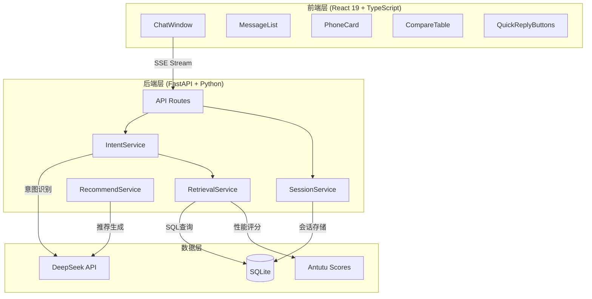

# 手机选购助手

---

## 项目概述

### 基本信息

| 属性 | 内容 |
|------|------|
| **项目名称** | `手机选购助手` |
| **项目简介** | AI对话式手机选购推荐系统，通过自然语言交互帮助用户找到最适合的手机 |
| **当前状态** | `已发布` |
| **创建日期** | `2026-04-01` |
| **最后更新** | `2026-05-15` |
| **负责人** | `个人项目` |
| **仓库地址** | `https://github.com/username/phone-pick-assistant` |

---

## 技术架构

### 架构概览



### 技术栈

| 层级 | 技术选型 | 版本 | 选型原因 |
|------|----------|------|----------|
| **前端框架** | `React` | `19.x` | 组件化开发，生态丰富，适合构建交互式UI |
| **UI组件库** | `TailwindCSS` | `3.x` | 原子化CSS，快速构建响应式界面 |
| **构建工具** | `Vite` | `6.x` | 快速HMR，现代化构建体验 |
| **后端框架** | `FastAPI` | `0.115.x` | 异步支持，自动API文档，类型提示友好 |
| **ORM** | `SQLAlchemy` | `2.x` | 成熟稳定，支持异步，与FastAPI配合良好 |
| **数据库** | `SQLite` | `3.x` | 轻量级，无需额外服务，适合中小规模数据 |
| **LLM服务** | `DeepSeek API` | `-` | 国产大模型，中文理解能力强，性价比高 |
| **部署平台** | `本地开发` | `-` | 个人项目，本地运行即可 |

### 核心模块

```
phone-pick-assistant/
├── backend/
│   ├── main.py              # FastAPI应用入口，中间件配置
│   ├── config.py            # 环境变量与配置管理
│   ├── api/routes/
│   │   ├── chat.py          # 对话API（SSE流式输出）
│   │   └── phones.py        # 手机数据API
│   ├── models/
│   │   ├── domain.py        # SQLAlchemy模型 + 安兔兔跑分映射
│   │   └── schemas.py       # Pydantic请求/响应模型
│   ├── services/
│   │   ├── intent.py        # 意图识别服务
│   │   ├── retrieval.py     # 数据库检索服务
│   │   ├── recommend.py     # 推荐生成服务
│   │   ├── session.py       # 会话管理服务
│   │   ├── camera_score.py  # 影像评分服务
│   │   └── llm.py           # LLM调用封装
│   ├── utils/
│   │   └── security.py      # 输入验证、Prompt注入防护
│   └── data/
│       ├── seed.py          # 数据库初始化
│       └── schema.sql       # 数据库表结构
├── frontend/
│   └── src/
│       ├── components/      # React组件
│       ├── services/api.ts  # API调用封装
│       ├── hooks/           # 自定义Hooks
│       └── types/           # TypeScript类型定义
├── tests/                   # 后端测试（33个测试文件）
└── docs/                    # 项目文档
```

---

## 核心功能

### 功能清单

| 功能模块 | 功能描述 | 优先级 | 状态 |
|----------|----------|--------|------|
| `智能推荐` | 多轮对话引导，根据预算、品牌、场景推荐手机 | `P0` | `已完成` |
| `参数对比` | 对比两款手机参数，差异高亮显示 | `P0` | `已完成` |
| `预算筛选` | 按价格区间筛选手机列表 | `P1` | `已完成` |
| `多轮追问` | 需求不完整时自动追问补充信息 | `P1` | `已完成` |
| `搜索历史` | localStorage存储历史对话，一键恢复 | `P2` | `已完成` |
| `流式输出` | SSE实时显示AI回复，提升用户体验 | `P1` | `已完成` |

### 功能实现细节

#### 智能推荐

**功能描述**：用户通过自然语言描述需求（如"预算3000左右，主要玩游戏"），系统自动识别意图、提取关键信息，从数据库检索匹配手机并生成个性化推荐。

**实现方案**：

```python
# 多轮对话流程
class ChatFlow:
    async def process(self, user_message: str, session_id: str):
        # 1. 意图识别（LLM + 规则降级）
        intent = await intent_service.recognize(user_message, history, profile)

        # 2. 用户画像更新（增量合并）
        profile = session_service.update_profile(session_id, intent)

        # 3. 需求完整性判断
        if not profile.is_complete():
            # 生成追问
            question = question_service.generate_full_response(profile)
            return {"type": "question", "data": question}

        # 4. 数据库检索
        phones = retrieval_service.search(intent, limit=5)

        # 5. LLM生成推荐
        async for chunk in recommend_service.recommend(user_message, phones):
            yield chunk
```

**关键文件**：
- `backend/services/intent.py` - 意图识别与用户画像管理
- `backend/services/retrieval.py` - 数据库检索与场景排序
- `backend/services/recommend.py` - 推荐文案生成

**注意事项**：
- 意图识别优先使用LLM，失败时降级到规则匹配
- 用户画像支持增量更新，避免重复询问
- 推荐结果必须包含"潜在不足"，确保客观性

#### 场景感知排序

**功能描述**：根据用户提到的使用场景（游戏、拍照、续航等），对候选手机进行智能排序，优先展示最匹配的机型。

**实现方案**：

```python
def _sort_by_scenario(self, phones: List[Phone], features: List[str]) -> List[Phone]:
    """场景感知排序"""
    if "游戏" in features:
        # 游戏场景：安兔兔跑分 > 内存 > 电池 > 价格
        return sorted(phones, key=lambda p: (
            -get_antutu_score(p.processor),
            -p.ram,
            -p.battery,
            p.price
        ))
    elif "拍照" in features:
        # 拍照场景：主摄像素 > 影像标签 > 价格
        return sorted(phones, key=lambda p: (
            -p.camera_main,
            0 if has_photo_tag(p) else 1,
            p.price
        ))
    elif "续航" in features:
        # 续航场景：电池容量降序
        return sorted(phones, key=lambda p: -p.battery)
    else:
        # 默认：价格升序
        return sorted(phones, key=lambda p: p.price)
```

**关键文件**：
- `backend/services/retrieval.py` - `_sort_by_scenario` 方法
- `backend/models/domain.py` - `get_antutu_score` 函数

**注意事项**：
- 安兔兔跑分数据从配置文件加载，支持热更新
- 影像标签包括：徕卡、哈苏、蔡司、潜望长焦等

#### 参数对比

**功能描述**：用户输入"对比小米14和华为Pura70"，系统提取两款手机型号，对比各项参数并高亮差异。

**实现方案**：

```python
# 对比流程
if intent_result.intent == IntentType.COMPARE:
    # 1. 提取手机型号
    phones = retrieval_service.get_phones_by_model(intent_result.phones_mentioned)

    # 2. LLM生成对比分析
    async for chunk in recommend_service.compare(phones):
        yield chunk

    # 3. 前端渲染对比表格（差异高亮）
```

**关键文件**：
- `backend/services/recommend.py` - `compare` 方法
- `frontend/src/components/CompareTable.tsx` - 对比表格组件

---

## 设计决策

### 技术选型

#### 选择 DeepSeek 作为 LLM 服务

**背景**：项目需要中文理解能力强的大模型来处理用户自然语言输入，识别意图并生成推荐文案。

**备选方案**：

| 方案 | 优点 | 缺点 |
|------|------|------|
| OpenAI GPT-4 | 能力最强，生态成熟 | 价格高，国内访问不稳定 |
| DeepSeek | 国产模型，中文理解好，性价比高 | 相比GPT-4能力略弱 |
| 本地部署模型 | 数据安全，无网络依赖 | 硬件成本高，维护复杂 |

**最终决策**：选择 `DeepSeek`

**决策理由**：
1. 中文理解能力强，适合国内用户场景
2. API价格低，适合个人项目
3. 国内访问稳定，无需代理

**权衡取舍**：
- 放弃了 GPT-4 的更强推理能力，但获得了更低的成本和更稳定的访问

#### 选择 SQLite 作为数据库

**背景**：项目需要存储手机数据（353款），支持按预算、品牌、场景等条件检索。

**备选方案**：

| 方案 | 优点 | 缺点 |
|------|------|------|
| PostgreSQL | 功能强大，支持复杂查询 | 需要额外服务，部署复杂 |
| SQLite | 轻量级，无需额外服务，适合中小规模 | 并发写入能力弱 |

**最终决策**：选择 `SQLite`

**决策理由**：
1. 数据量小（353条记录），SQLite完全够用
2. 无需额外数据库服务，简化部署
3. 数据文件可直接复制备份

### 架构演进

| 日期 | 版本 | 变更内容 | 变更原因 |
|------|------|----------|----------|
| `2026-04-01` | `v1.0` | 初始架构，单轮对话 | 项目启动 |
| `2026-04-15` | `v1.1` | 新增多轮追问功能 | 提升推荐精准度 |
| `2026-04-25` | `v1.2` | 新增场景感知排序 | 优化推荐排序逻辑 |
| `2026-05-01` | `v1.3` | 新增影像评分系统 | 提升拍照场景推荐质量 |
| `2026-05-10` | `v1.4` | 新增痛点检测与追问 | 处理预算与需求冲突场景 |

---

## 测试覆盖

### 测试策略

| 测试类型 | 覆盖范围 | 工具/框架 | 运行频率 |
|----------|----------|-----------|----------|
| **单元测试** | 后端服务层、工具函数 | pytest | 每次提交 |
| **集成测试** | API接口、数据库操作 | pytest + httpx | 每次合并 |
| **E2E测试** | 多轮对话流程 | pytest + asyncio | 每次发布 |
| **前端测试** | React组件 | Vitest + Testing Library | 每次提交 |

### 测试覆盖率

```
后端测试统计：
- 测试文件：33个
- 测试用例：615个
- 覆盖模块：intent, retrieval, recommend, session, camera_score, security 等

前端测试统计：
- 测试文件：5个
- 测试用例：37个
- 覆盖组件：ChatWindow, MessageItem, QuickReplyButtons, ErrorBoundary

E2E测试场景：
- 多轮对话追问流程
- 预算与需求冲突处理
- 对比功能
```

### 测试命令

```bash
# 后端测试
cd "D:\my project\phone-pick-assistant"
.venv\Scripts\python.exe -m pytest tests/ -v

# 前端测试
cd frontend
npm test

# E2E测试
.venv\Scripts\python.exe -m pytest tests/e2e_test_multi_turn.py -v
```

---

## 部署说明

### 环境要求

| 依赖 | 最低版本 | 推荐版本 | 说明 |
|------|----------|----------|------|
| Python | `3.10` | `3.12` | 运行环境 |
| Node.js | `18.x` | `20.x` | 前端构建 |
| pip | `23.x` | `24.x` | 包管理器 |

### 环境变量

```bash
# 必需变量
DEEPSEEK_API_KEY=your_api_key_here
DATABASE_URL=sqlite:///./data/phones.db

# 可选变量
APP_ENV=development
LOG_LEVEL=INFO
CORS_ORIGINS=http://localhost:5173,http://127.0.0.1:5173
MAX_CONTEXT_TOKENS=4000
MAX_CONTEXT_MESSAGES=10
```

### 启动步骤

#### 开发环境

```bash
# 1. 克隆仓库
git clone https://github.com/username/phone-pick-assistant.git
cd phone-pick-assistant

# 2. 创建虚拟环境
python -m venv .venv
.venv\Scripts\activate  # Windows
source .venv/bin/activate  # Linux/Mac

# 3. 安装依赖
pip install -r requirements.txt -i https://pypi.tuna.tsinghua.edu.cn/simple

# 4. 配置环境变量
cp .env.example .env
# 编辑 .env 文件，填入 DEEPSEEK_API_KEY

# 5. 初始化数据库
python -m backend.data.seed

# 6. 启动后端（端口8002）
.venv\Scripts\python.exe -m uvicorn backend.main:app --reload --port 8002

# 7. 启动前端（新终端）
cd frontend
npm install --registry=https://registry.npmmirror.com
npm run dev
```

访问 http://localhost:5173

### 部署检查清单

- [ ] 环境变量已正确配置（DEEPSEEK_API_KEY）
- [ ] 数据库已初始化（phones.db 存在）
- [ ] 后端服务可访问（http://localhost:8002/health 返回 healthy）
- [ ] 前端可访问（http://localhost:5173 正常显示）
- [ ] CORS配置正确（前后端通信无跨域错误）

---

## 项目亮点

### 关键特性

#### 多轮对话追问

**价值**：用户往往无法一次性描述清楚需求，通过追问引导用户补充预算、品牌偏好、使用场景等信息，提升推荐精准度。

**实现亮点**：
- 用户画像增量更新，避免重复询问
- 需求完整性自动判断（预算 + 至少一个场景需求）
- 快捷回复按钮，降低用户输入成本

**代码示例**：

```python
# 需求完整性判断
def is_complete(self) -> bool:
    has_budget = self.budget_max is not None and self.budget_max < 100000
    has_feature = any([
        self.gaming_need, self.camera_need, self.battery_need
    ])
    return has_budget and has_feature
```

#### 场景感知排序

**价值**：不同使用场景关注不同参数，游戏场景优先性能，拍照场景优先影像配置，续航场景优先电池容量。

**实现亮点**：
- 安兔兔跑分数据驱动，客观量化性能
- 影像标签识别（徕卡/哈苏/蔡司），提升拍照推荐质量
- 支持多场景组合排序

#### 痛点检测与追问

**价值**：当用户预算与需求冲突时（如"预算2000，拍照要好"），主动提示用户权衡取舍，避免推荐不切实际的产品。

**实现亮点**：
- 基于价格区间与场景需求匹配度计算痛点严重程度
- 三级痛点提示（轻度/中度/重度）
- 提供替代建议（如"提高预算"或"降低预期"）

### 性能指标

| 指标 | 目标值 | 实际值 | 说明 |
|------|--------|--------|------|
| API响应时间 | `< 500ms` | `~200ms` | P95延迟（不含LLM） |
| LLM首字延迟 | `< 2s` | `~1.5s` | DeepSeek API |
| 并发处理 | `50 QPS` | `50 QPS` | 100%成功率 |
| 数据量 | `-` | `353款` | 手机数据 |
| 图片覆盖率 | `> 90%` | `93.7%` | 手机图片 |

### 创新点

1. **意图识别双轨制**：LLM识别 + 规则降级，确保高可用性
2. **影像评分体系**：三维度评分（芯片算力30% + 影像硬件35% + 影像算法30%），量化拍照能力
3. **缺点强制披露**：推荐结果必须包含"潜在不足"，确保客观性

---

## 附录

### 相关文档

- [API文档](./api.md)
- [影像评分说明](./camera-scoring.md)
- [多轮对话设计](./multi-turn-design.md)

### 参考资料

- [FastAPI官方文档](https://fastapi.tiangolo.com/)
- [DeepSeek API文档](https://platform.deepseek.com/docs)
- [安兔兔跑分排名](https://www.antutu.com/ranking/rank301.htm)

---

> 文档最后更新：`2026-05-15` | 维护者：`个人项目`
